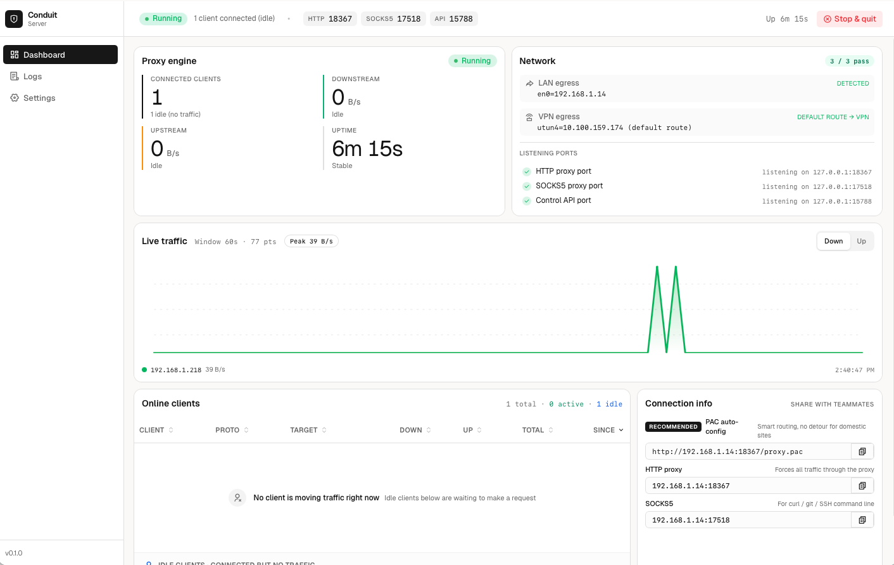
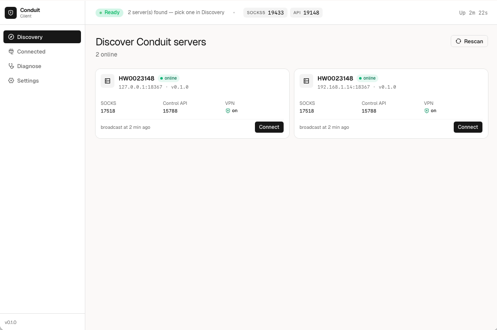

# Conduit

> Zero-config LAN VPN sharing — let one Mac (with VPN) act as the gateway for every other device on the same Wi-Fi.

[中文](./README_zh.md) · [Landing page](https://shetengteng.github.io/conduit/) · [Download DMG](https://github.com/shetengteng/conduit/releases/latest) · [Changelog](./CHANGELOG.md)

    

---

## What it does, in one line

**Install Conduit Server on a Mac that holds a VPN connection. Install Conduit Client on every other device on the same Wi-Fi. Now they all egress through that VPN.** Zero config, no router tweaks, no Python.

---

### Server · dashboard



> Single screen: status badge, HTTP / SOCKS5 / control-API ports, connected clients, standby clients, real-time traffic chart, mDNS broadcast info, VPN interface state, default PAC policy.

### Client · connected dashboard



> 5-step connect progress (port → probe → PAC → heartbeat → ready), current routing policy, heartbeat state machine, up/down throughput meter, smart per-host route table, mDNS service list.

---

## 5 features that matter

| Feature | What it means |
|---|---|
| **mDNS zero-config discovery** | Server appears on the client's "Discovery" page within 5–10 s on the same Wi-Fi. No manual IP / port. |
| **5-step connect wizard** | Port check → TCP probe → PAC fetch → heartbeat → system-proxy switch. Each step is visible, retryable, and step 4 auto-rolls back any partial state on failure. |
| **Smart per-host routing** | DIRECT-first 1.5 s head-start. Falls back to VPN. Decisions cached for 5 min (survives restart). |
| **1 Hz live traffic meter** | Up / down bytes pushed via Server-Sent Events — link health at a glance. |
| **macOS system-proxy auto-switch** | Takes over the SOCKS5 system proxy. Restores on disconnect. Auto-prompts for admin password when sandbox blocks it (cached 5 min in keychain). |

---

## Quick start (90 seconds)

1. **Download the DMG** from [GitHub Releases](https://github.com/shetengteng/conduit/releases/latest). Pick `aarch64` for Apple Silicon, `x64` for Intel.
2. **Install** — double-click the DMG → drag the `.app` into `/Applications`.
3. **Gatekeeper blocks first launch** → see [Troubleshooting](#troubleshooting) below.
4. **On the VPN-holding Mac**, open Conduit Server and wait for the status badge to turn green.
5. **On every other device**, open Conduit Client. The "Discovery" page should show a server card within 5–10 s.
6. **Click "Connect"** — the 5-step stepper finishes in ~2-3 s, then macOS asks for your admin password to set the system proxy.
7. **Open google.com** — you're now egressing through the shared VPN.

---

## Troubleshooting

| Symptom | Fix |
|---|---|
| `"Conduit Server" is damaged` / `cannot be opened because the developer cannot be verified` on first launch | DMGs are ad-hoc signed (Apple notarization pending). Run `sudo xattr -dr com.apple.quarantine "/Applications/Conduit Server.app"` (and same for Client). If you still get `Operation not permitted` (macOS 15 SIP), open System Settings → Privacy & Security → scroll to bottom → click **Open Anyway**. |
| Connect step 4 pops up "Conduit wants to make changes" admin prompt | Expected since v0.2.0: setting the system SOCKS proxy via `networksetup` requires admin. Enter the password once — keychain caches it for 5 min. To suppress entirely, set `enable_system_proxy=false` in client config and configure SOCKS5 manually in your browser. |
| Connect step 4 fails with `cancelled by user` | You dismissed the password prompt. Conduit auto-rolls back partial state — just click **Connect** again. |
| Client "Discovery" page stays empty | System Settings → Privacy & Security → Local Network → enable Conduit Client. |
| Server "Active clients" stays 0 even though Client connected | Client only sends a heartbeat (passive registration); the KPI counts active SOCKS5/HTTP sessions only. Open google.com through the proxy and the number bumps to 1. |
| "Standby clients" list shows a closed client forever | Should self-evict within 30 s as of v0.2.0 (passive-client TTL). If not, check the server log for missed heartbeats. |
| Wipe everything and start over | `rm -rf ~/Library/Application\ Support/Conduit/` |

---

## Status

- ✅ **v0.2.0** (2026-05-07) — pure Rust rewrite, Python sidecar removed, DMG ~91 % smaller; 186 tests pass / 0 clippy warnings
- ⏳ **v0.3 backlog** — Windows / Linux client (cross-compile matrix), `tauri-plugin-updater` auto-update, editable settings panel, Apple notarization

Full per-version history → [CHANGELOG](./CHANGELOG.md) · v0.2.0 rewrite detail → [release notes](./scripts/release-notes-v0.2.0.md) · design docs → [design/](./design/)

---

<details>
<summary><strong>For developers</strong> (click to expand)</summary>

### Requirements

| Software | Version | Notes |
|---|---|---|
| macOS | 13+ | Apple Silicon & Intel both fine |
| Node | ≥ 20.10 | `node -v` |
| pnpm | ≥ 9 | `corepack enable pnpm` or `npm i -g pnpm@9` |
| Rust toolchain | ≥ 1.84 | `rustup default stable` |

> No Python or PyInstaller required as of v0.2.0.

### Source-code install + dev mode

```bash
git clone <repo> conduit && cd conduit
pnpm install                          # 6 workspaces, ~30 s
pnpm dev:server                       # terminal 1: launch Server
pnpm dev:client                       # terminal 2: launch Client
```

Success indicators:
- Server terminal: `[mdns] advertised <hostname>._conduit._tcp.local. @ <ip>:<port> (vpn=on|off)`
- Client terminal: `[control_api] listening on http://127.0.0.1:NNNN` + `[discoverer] server_discovered: …`
- Both apps appear in the macOS menu bar (tray icons)

> First launch macOS will prompt twice (Local Network + System Proxy) — allow both.

### Build the DMGs yourself

```bash
./scripts/release.sh    # pnpm tauri build + collect into dist/, ~3 min cold
```

Output:

| File | Size |
|---|---|
| `dist/server/Conduit Server_<ver>_aarch64.dmg` | ~4–5 MB |
| `dist/client/Conduit Client_<ver>_aarch64.dmg` | ~5–6 MB |

> Same ad-hoc signing caveat as in [Troubleshooting](#troubleshooting).

### Common commands

| Command | Effect |
|---|---|
| `pnpm dev:server` / `pnpm dev:client` | Run app in dev mode (HMR) |
| `pnpm build:server` / `pnpm build:client` | Build .app + .dmg |
| `pnpm dev:server-ui` / `pnpm dev:client-ui` | Front-end Vite only (UI tweaking) |
| `cargo test --workspace` | Run all Rust tests (**186 passing** / 0 failed) |
| `cargo clippy --workspace --all-targets -- -D warnings` | Lint check (**0 warning**) |
| `cargo build --workspace --release` | Full release build (~1m30s on M1 Pro) |
| `bash scripts/e2e.sh --headless-only` | Headless 1-MiB SOCKS5 round-trip smoke test (~2.4 s) |

### Repo layout

```
conduit/
├── Cargo.toml                # Cargo workspace root
├── crates/
│   └── conduit-core/         # Shared crate (2417 lines):
│                             #   pac / socks5_proto / types / relay /
│                             #   mdns / events / healthz / boot_error / ports
├── server-app/               # Conduit Server desktop app
│   ├── src-tauri/            # Tauri main + tray + in-process ProxyCore
│   │                         # (hand-rolled HTTP/1.1 + SOCKS5 RFC 1928)
│   └── ui/                   # Vue 3 + shadcn-vue + Tailwind
├── client-app/               # Conduit Client desktop app
│   ├── src-tauri/            # Tauri main + tray + autostart + in-process ClientCore
│   │                         # (discoverer / route_resolver / system_proxy)
│   └── ui/                   # Vue 3 + shadcn-vue + Tailwind
├── scripts/                  # release.sh / bump-version.sh /
│                             # publish-release-notes.sh / e2e.sh
├── design/                   # Date-prefixed design docs
│   ├── 2026-05-06-1-技术栈精简可行性分析.md
│   ├── 2026-05-06-2-Conduit-Rust-重写设计文档.md
│   ├── 2026-05-06-3-Conduit-Rust-重写TODO清单-98%-v0.2.0.md
│   └── archive/              # Python-era historical docs
├── docs/                     # GitHub Pages landing (index.html + screenshots)
├── CHANGELOG.md              # Keep-a-Changelog format
└── package.json              # pnpm workspace root
```

### Tech stack at a glance

- **App shell**: Tauri 2 + macOS system tray
- **Business process**: single Rust process (no Python sidecar)
  - HTTP forward proxy: hand-rolled HTTP/1.1 (CONNECT + absolute-URI + hop-by-hop strip)
  - SOCKS5: `conduit_core::socks5_proto` (RFC 1928 byte-level codec, shared by both apps)
  - Service discovery: [mdns-sd](https://crates.io/crates/mdns-sd)
  - Async runtime: tokio + tokio-util CancellationToken
  - Serialization: serde (snake_case wire-format aligned 1:1 with UI TS types)
  - Errors: thiserror + custom `BootError` with Tauri command `Serialize`
- **UI**: Vue 3 + Composition API + shadcn-vue + Tailwind v4 + Vite
- **In-process IPC**: 127.0.0.1 control HTTP API + Server-Sent Events
- **Cross-process discovery**: mDNS / Bonjour `_conduit._tcp.local.`
- **Packaging**: tauri build + ad-hoc codesign

Full design and decision rationale: [Conduit Rust rewrite design doc](./design/2026-05-06-2-Conduit-Rust-重写设计文档.md) (see §C.3 / §C.4 for the dependency reconciliation).

### Python v0.1.x history

v0.1.4 and earlier used a Python sidecar architecture, archived on the [`archive/v0.1.x-python`](https://github.com/shetengteng/conduit/tree/archive/v0.1.x-python) branch.

</details>

---

## License

Private project, not yet publicly distributed.
