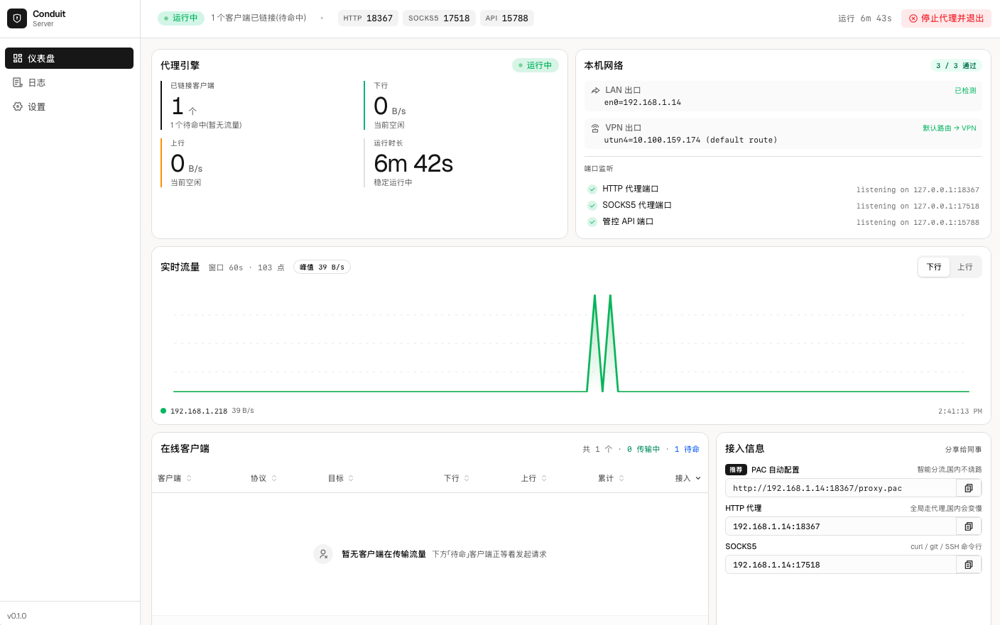
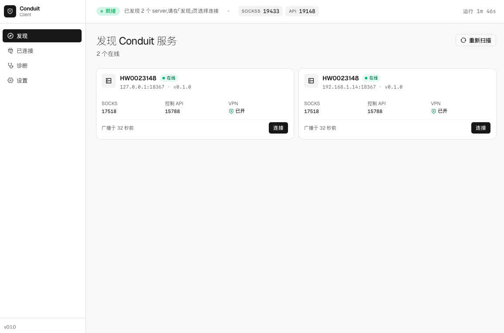

# Conduit

> 零配置局域网 VPN 共享 —— 让一台拥有 VPN 的 Mac 成为同一 Wi-Fi 下其它所有设备的网关。

[English](./README.md) · [官网](https://shetengteng.github.io/conduit/) · [下载 DMG](https://github.com/shetengteng/conduit/releases/latest) · [更新日志](./CHANGELOG.md)

    

---

## 一句话说明

**一台 Mac 装上 Conduit Server，整个 Wi-Fi 下的其它设备装 Conduit Client，就能共用这台 Mac 上的 VPN 出口。** 零配置，零路由器修改，零 Python 依赖。

---

### Server · 主控台



> 一屏显示：运行状态徽章、HTTP / SOCKS5 / 控制 API 三端口、已连接客户端、待命客户端、实时流量曲线、mDNS 广播信息、VPN 接口状态、PAC 默认策略。

### Client · 已连接看板



> 5 步连接进度（端口 → 探活 → 代理 → 心跳 → 就绪）、当前路由策略、心跳状态机、上下行流量计、智能 per-host 路由表、mDNS 服务列表。

---

## 5 大特性

| 特性 | 说明 |
|---|---|
| **mDNS 零配置发现** | Server 在同一 Wi-Fi 5-10 秒自动出现在 Client 的「发现」页，无需手填 IP / 端口 |
| **5 步连接向导** | 端口检查 → TCP 探活 → PAC 拉取 → 心跳启动 → 系统代理切换，每一步可视、失败可重试，第 4 步失败自动回滚 partial state |
| **智能 per-host 路由** | DIRECT-first 1.5 s 抢答，失败回落 VPN，决策结果缓存 5 分钟（重启进程仍在） |
| **1 Hz 实时流量曲线** | 通过 Server-Sent Events 推送上下行字节，连接质量一眼可见 |
| **macOS 系统代理自动切换** | 接管 SOCKS5 系统代理；断开自动恢复；sandbox 权限不足时自动弹密码框（5 min keychain 缓存） |

---

## 快速开始（90 秒）

1. **下载 DMG** —— 到 [GitHub Releases](https://github.com/shetengteng/conduit/releases/latest) 按 Mac 架构下载（Apple Silicon 选 `aarch64`，Intel 选 `x64`）
2. **安装** —— 双击 DMG → 把 `.app` 拖进 `/Applications`
3. **首次打开被 Gatekeeper 拦截** → 见下方 [常见问题](#常见问题)
4. **持有 VPN 的 Mac 打开 Conduit Server**，等顶部状态徽章变绿
5. **其它设备打开 Conduit Client**，「发现」页 5-10 秒内看到 Server 卡片
6. **点击「连接」** —— 走完 5 步进度（约 2-3 秒），弹密码框允许设置系统代理
7. **打开 google.com** —— 已通过共享 VPN 出网

---

## 常见问题

| 现象 | 处理 |
|---|---|
| 第一次打开提示「已损坏」/「无法验证开发者」 | DMG 是 ad-hoc 签名（暂未 Apple 公证）。终端跑 `sudo xattr -dr com.apple.quarantine "/Applications/Conduit Server.app"`（Client 同理）。仍报 `Operation not permitted`（macOS 15 SIP）→ 系统设置 → 隐私与安全 → 拉到底点「仍要打开」 |
| 连接第 4 步弹密码框「Conduit 想要修改系统代理」 | 这是 v0.2.0 起的预期行为：`networksetup` 设置系统代理需 admin。一次输入 → keychain 缓存 5 分钟内不再问。完全不想要弹框 → 把 client 配置 `enable_system_proxy=false`，浏览器手动配 SOCKS5 |
| 连接第 4 步失败 `cancelled by user` | 在密码框点了「取消」。Conduit 已自动 rollback partial state，不会留下半连接。重新点「连接」即可 |
| Client「发现」页一直空 | 系统设置 → 隐私与安全 → 本地网络 → 启用 Conduit Client |
| Server「活跃客户端」一直 0，但 Client 已连接 | Client 仅发心跳（passive 注册），KPI 只统计活跃 SOCKS5/HTTP 会话。让 Client 上的浏览器真发流量，数字就会变成 1 |
| 「待命客户端」列表里关掉的 client 不消失 | v0.2.0 起 30s passive TTL 自动清理。仍不消失 → 看 server 端心跳日志 |
| 想完全推倒重来 | `rm -rf ~/Library/Application\ Support/Conduit/` |

---

## 当前进度

- ✅ **v0.2.0**（2026-05-07） —— 纯 Rust 重写，Python sidecar 移除，DMG 体积砍 91%；186 测试通过 / 0 clippy warning
- ⏳ **v0.3 backlog** —— Windows / Linux Client（cross-compile 矩阵）、`tauri-plugin-updater` 自动更新、可编辑设置面板、Apple 公证

完整版本历史 → [CHANGELOG](./CHANGELOG.md) · v0.2.0 重写细节 → [release notes](./scripts/release-notes-v0.2.0.md) · 设计文档 → [design/](./design/)

---

<details>
<summary><strong>给开发者</strong>（点击展开）</summary>

### 环境要求

| 软件 | 版本 | 备注 |
|---|---|---|
| macOS | 13+ | Apple Silicon 与 Intel 均可 |
| Node | ≥ 20.10 | `node -v` |
| pnpm | ≥ 9 | `corepack enable pnpm` 或 `npm i -g pnpm@9` |
| Rust 工具链 | ≥ 1.84 | `rustup default stable` |

> v0.2.0 起不再需要 Python 或 PyInstaller。

### 源码安装与开发模式

```bash
git clone <repo> conduit && cd conduit
pnpm install                          # 6 个 workspace，约 30 秒
pnpm dev:server                       # 终端 1：启动 Server
pnpm dev:client                       # 终端 2：启动 Client
```

启动成功标志：
- Server 终端：`[mdns] advertised <hostname>._conduit._tcp.local. @ <ip>:<port> (vpn=on|off)`
- Client 终端：`[control_api] listening on http://127.0.0.1:NNNN` + `[discoverer] server_discovered: …`
- 双端 macOS 菜单栏出现托盘图标

> 首次运行 macOS 会弹两次授权框（本地网络 + 系统代理），都允许。

### 打 DMG

```bash
./scripts/release.sh    # pnpm tauri build + 收集到 dist/，约 3 分钟冷构建
```

输出：

| 文件 | 体积 |
|---|---|
| `dist/server/Conduit Server_<ver>_aarch64.dmg` | ~4–5 MB |
| `dist/client/Conduit Client_<ver>_aarch64.dmg` | ~5–6 MB |

> 同样有 ad-hoc 签名问题，参见 [常见问题](#常见问题)。

### 常用命令

| 命令 | 作用 |
|---|---|
| `pnpm dev:server` / `pnpm dev:client` | 开发模式启动应用（HMR） |
| `pnpm build:server` / `pnpm build:client` | 构建 .app + .dmg |
| `pnpm dev:server-ui` / `pnpm dev:client-ui` | 仅启动 Vite 前端（调 UI 时用） |
| `cargo test --workspace` | 跑所有 Rust 测试（**186 通过** / 0 失败） |
| `cargo clippy --workspace --all-targets -- -D warnings` | Lint 检查（**0 warning**） |
| `cargo build --workspace --release` | Release 完整构建（M1 Pro 约 1m30s） |
| `bash scripts/e2e.sh --headless-only` | 跑无 GUI 的 SOCKS5 1 MiB 双向吞吐 smoke 测试（约 2.4 秒） |

### 仓库结构

```
conduit/
├── Cargo.toml                # Cargo workspace 根
├── crates/
│   └── conduit-core/         # 共享 crate（2417 行）：
│                             #   pac / socks5_proto / types / relay /
│                             #   mdns / events / healthz / boot_error / ports
├── server-app/               # Conduit Server 桌面应用
│   ├── src-tauri/            # Tauri 主进程 + 托盘 + 内嵌 ProxyCore
│   │                         # （hand-rolled HTTP/1.1 + SOCKS5 RFC1928）
│   └── ui/                   # Vue 3 + shadcn-vue + Tailwind
├── client-app/               # Conduit Client 桌面应用
│   ├── src-tauri/            # Tauri 主进程 + 托盘 + 自启 + 内嵌 ClientCore
│   │                         # （discoverer / route_resolver / system_proxy）
│   └── ui/                   # Vue 3 + shadcn-vue + Tailwind
├── scripts/                  # release.sh / bump-version.sh /
│                             # publish-release-notes.sh / e2e.sh
├── design/                   # 设计文档（按日期前缀归档）
│   ├── 2026-05-06-1-技术栈精简可行性分析.md
│   ├── 2026-05-06-2-Conduit-Rust-重写设计文档.md
│   ├── 2026-05-06-3-Conduit-Rust-重写TODO清单-98%-v0.2.0.md
│   └── archive/              # Python 时代历史文档
├── docs/                     # GitHub Pages 落地页（index.html + 截图）
├── CHANGELOG.md              # Keep-a-Changelog 格式
└── package.json              # pnpm workspace 根
```

### 技术栈一览

- **应用壳**：Tauri 2 + macOS 系统托盘
- **业务进程**：Rust 单进程（无 Python sidecar）
  - HTTP forward proxy：手写 HTTP/1.1（CONNECT + absolute-URI + hop-by-hop strip）
  - SOCKS5：`conduit_core::socks5_proto`（RFC 1928 字节级编解码，双端共享）
  - 服务发现：[mdns-sd](https://crates.io/crates/mdns-sd)
  - 异步运行时：tokio + tokio-util CancellationToken
  - 序列化：serde（snake_case wire-format 与 UI 端 TS types 1:1）
  - 错误模型：thiserror + 自定义 `BootError` Tauri command Serialize
- **UI**：Vue 3 + Composition API + shadcn-vue + Tailwind v4 + Vite
- **进程内 IPC**：127.0.0.1 控制 HTTP API + Server-Sent Events
- **跨进程发现**：mDNS / Bonjour `_conduit._tcp.local.`
- **打包**：tauri build + ad-hoc codesign

完整设计与决策见 [Conduit Rust 重写设计文档](./design/2026-05-06-2-Conduit-Rust-重写设计文档.md)（含 §C.3 与 §C.4 详细依赖说明）。

### Python v0.1.x 历史

v0.1.4 及之前为 Python sidecar 架构，已归档到 [`archive/v0.1.x-python`](https://github.com/shetengteng/conduit/tree/archive/v0.1.x-python) 分支。

</details>

---

## 协议

私人项目，暂未公开分发。
