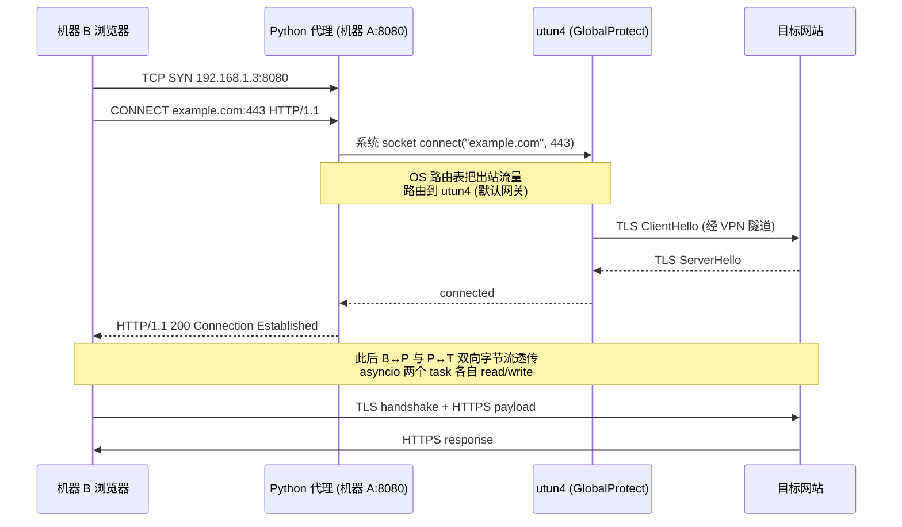
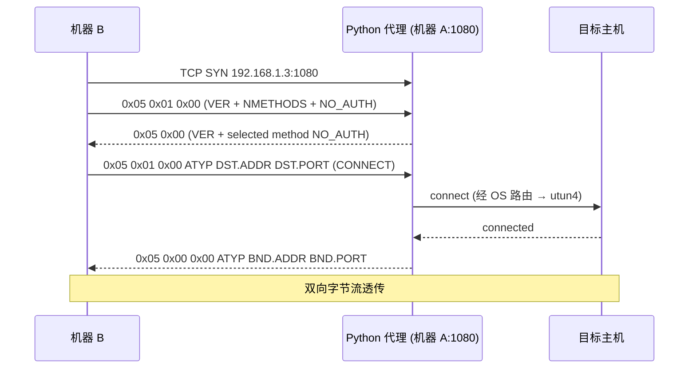

# 局域网共享 VPN 代理 — 简明设计

> **场景**：机器 A 已连接公司 VPN（GlobalProtect / 全流量），希望让同一 WiFi 下的机器 B/C 通过机器 A 的 VPN 出口访问外网及 VPN 内部资源。
>
> **形态**：单进程 Python 服务，同时监听 HTTP 代理 + SOCKS5 代理两个端口。0 三方依赖（仅用 Python 3.9+ 标准库 `asyncio`）。

---

## 1. Background

### 1.1 当前环境（已检测）

| 检测项 | 结果 |
|---|---|
| 机器 A OS | macOS |
| VPN 软件 | Palo Alto **GlobalProtect** |
| VPN 接口 | `utun4` (MTU 1400) |
| 路由模式 | **全流量 VPN**（默认路由经 VPN 隧道） |
| 机器 A LAN IP | `192.168.1.3`（局域网内其他设备访问入口） |

### 1.2 关键洞察

> 系统级 VPN 在 OS 路由层接管所有出站流量，**Python 代理无需任何 VPN 集成**。代理只负责把 LAN 入站连接的字节流，原样转发到目标主机；OS 根据路由表自动把出站流量送进 `utun4`。

```text
                    ┌──────────────┐
                    │  公司内网     │
                    │  / 公网      │
                    └──────┬───────┘
                           │ ↑↓
                    ┌──────┴───────┐
                    │ GlobalProtect│  utun4 (VPN 隧道, OS 接管)
                    └──────┬───────┘
                           │ ↑↓
   ┌──────────┐    ┌───────┴───────┐    ┌──────────┐
   │ 机器 B   │ ←→ │  机器 A       │ ←→ │ 机器 C   │
   │ 192.168. │    │  Python 代理  │    │ 192.168. │
   │ 1.x      │    │  192.168.1.3  │    │ 1.x      │
   └──────────┘    │  :8080 HTTP   │    └──────────┘
                   │  :1080 SOCKS5 │
                   └───────────────┘
```

### 1.3 Non-Goals

- ❌ **不做** 流量加密、HTTPS 中间人、抓包审计 — 纯透传代理
- ❌ **不做** 用户认证（用户已确认仅家用/办公私 WiFi）
- ❌ **不做** 域名级分流 — 全部流量都尝试出站，由 OS 路由决定走 VPN 还是直连
- ❌ **不做** UDP（SOCKS5 仅支持 TCP CONNECT，不支持 UDP ASSOCIATE）
- ❌ **不做** 自动开机启动、systemd / launchd 集成 — 第一版手动 `python3 server.py` 即可

---

## 2. 整体架构

### 2.1 进程结构

```text
proxy_server.py (单进程, 单 asyncio event loop)
├── HTTP Proxy Server   listen 0.0.0.0:8080
│   └── handle_http_client()
│       ├── CONNECT method → bidirectional tunnel  (HTTPS)
│       └── GET/POST/...   → forward request, relay response  (HTTP)
│
└── SOCKS5 Proxy Server listen 0.0.0.0:1080
    └── handle_socks5_client()
        ├── auth negotiation (NO AUTH)
        ├── CONNECT request   → bidirectional tunnel
        └── (BIND / UDP ASSOCIATE 不支持, 直接拒绝)
```

### 2.2 流量路径（HTTPS 经 HTTP 代理为例）



### 2.3 流量路径（SOCKS5 为例）



---

## 3. 模块拆分

### 3.1 文件清单

```text
20260429-lan-vpn-proxy/
├── 2026-04-29-局域网共享VPN代理简明设计.md  ← 本文件
├── proxy_server.py        # 主入口, asyncio.run(main()), banner, signal handler
├── http_proxy.py          # HTTP/HTTPS 代理 + PAC/wpad fast-path + /check + /status
├── socks5_proxy.py        # SOCKS5 代理 handler
├── relay.py               # 双向字节流透传工具
├── config.py              # 配置（端口、绑定地址、IP 白名单、PAC 路径）
├── pac_engine.py          # PAC 规则解析器 + 决策函数 (服务端 /check 用)
├── proxy.pac              # 客户端智能分流规则 (dnsDomainIs 友好模板)
└── README.md              # 启动/配置说明（待用户确认是否生成）
```

### 3.2 核心函数签名

```python
# proxy_server.py
async def main(cfg: Config) -> None:
    http_srv = await asyncio.start_server(handle_http,   cfg.bind, cfg.http_port)
    sock_srv = await asyncio.start_server(handle_socks5, cfg.bind, cfg.socks_port)
    await asyncio.gather(http_srv.serve_forever(), sock_srv.serve_forever())

# http_proxy.py
async def handle_http(reader: StreamReader, writer: StreamWriter) -> None: ...
# 解析首行 → 分发 CONNECT (隧道) / 其他 (转发请求)

# socks5_proxy.py
async def handle_socks5(reader: StreamReader, writer: StreamWriter) -> None: ...
# 协议握手 → CONNECT 隧道

# relay.py
async def pipe(src: StreamReader, dst: StreamWriter) -> None: ...
async def bidirectional_relay(c_reader, c_writer, t_reader, t_writer) -> None:
    await asyncio.gather(pipe(c_reader, t_writer), pipe(t_reader, c_writer),
                         return_exceptions=True)
```

### 3.3 关键技术点

| 点 | 实现 |
|---|---|
| 并发模型 | `asyncio` 单线程事件循环；每个 client 连接一个 coroutine |
| 双向透传 | `asyncio.gather(pipe(A,B), pipe(B,A))`，任一方向 EOF/异常即关闭对端 `writer` |
| 缓冲 | `reader.read(65536)` 块读，避免大对象内存堆积 |
| 超时 | `asyncio.wait_for` 包裹首次握手（5s）、`connect`（10s）；建链后透传不加超时（长连接可能闲置） |
| 优雅关闭 | `try/finally` 保证 `writer.close()` + `await writer.wait_closed()` |
| 信号 | `loop.add_signal_handler(SIGINT/SIGTERM)` → 关 server 后等待 in-flight 退出 |

---

## 4. 配置项

```python
# config.py
@dataclass
class Config:
    bind: str = "0.0.0.0"          # 监听地址，"0.0.0.0" 即接受 LAN 接入
    http_port: int = 8080
    socks_port: int = 1080

    # 安全：只允许 LAN 段访问，避免万一暴露公网
    allowed_cidrs: list[str] = field(default_factory=lambda: ["192.168.0.0/16",
                                                              "10.0.0.0/8",
                                                              "172.16.0.0/12",
                                                              "127.0.0.1/32"])

    # CONNECT 目标端口白名单，避免被滥用做任意端口跳板
    allowed_connect_ports: set[int] = field(default_factory=lambda: {80, 443, 22, 8080, 8443})

    # PAC 智能分流（§7）
    pac_file_path: str = "proxy.pac"     # 静态 PAC 文件路径
    pac_endpoints: tuple = ("/proxy.pac", "/wpad.dat")  # 客户端拉取路径

    # 日志
    log_file: str = "proxy.log"
    log_level: str = "INFO"
    redact_query: bool = True       # URL query 中的 token/key 写日志前脱敏
```

---

## 5. 安全风险（必读）

> ⚠️ **本服务把公司 VPN 出口共享给局域网，多数公司 IT 安全策略禁止此类做法。在公司管理设备上启用前请自行评估合规风险。**

| # | 风险 | 缓解 |
|---|---|---|
| R1 | 绕过 VPN 端点合规检查（GlobalProtect HIP 检查只看机器 A，机器 B/C 不被检查） | 仅在私人 WiFi 下使用；不要在客户/公共网络下启用 |
| R2 | 任意人接入同一 WiFi 后即可白嫖 VPN | `allowed_cidrs` IP 段白名单；首次落地建议增加进一步限制（如固定客户端 IP） |
| R3 | CONNECT 方法允许任意目标端口，可能被滥用做 SMTP/SSH 跳板攻击 | `allowed_connect_ports` 端口白名单 |
| R4 | 日志中可能落入 token / Cookie / Authorization | 仅记录 method+host+port+status；query 中 `token=`、`access_key=` 等关键字脱敏；**绝不记录 body** |
| R5 | macOS Firewall 弹窗拒绝监听 | 首次运行需在「系统设置 → 网络 → 防火墙」允许 Python 接受入站连接 |
| R6 | 代理本身漏洞（解析错误、内存泄漏） | 严格校验 SOCKS5 字节、HTTP 首行；`asyncio.wait_for` 防 slowloris；`try/except` 兜底关闭连接 |
| R7 | VPN 断开后流量从本地 ISP 出口出去（可能不符合预期） | 启动时打印当前默认路由 interface；运行时记录每次出站连接，用户可在日志确认；不主动 fail-close（避免误杀） |
| R8 | PAC 文件可能泄露公司内部域名清单（任何接入 LAN 的人都能 `curl /proxy.pac`） | PAC 端点也受 `allowed_cidrs` 限制；公司内网域名建议放在单独 `proxy.internal.pac` 仅授信客户端拉取，公开 PAC 只放通用规则 |

### 5.1 Review Card（按 Secure Development Principles）

- 威胁快照：LAN 内部信任，公司 VPN 不可信任意客户端 → R1/R2/R3
- 输入校验：HTTP 首行 / SOCKS5 字节边界检查 → R6
- 秘密存储：无（不需要密码）
- 加密：复用上游 TLS（HTTPS 透传），代理不解密
- 鉴权 / 会话：无（用户明确选择），仅 IP 白名单
- 授权：CIDR + 端口白名单 → R2/R3
- 日志：脱敏 + 不记录 body → R4
- 文件 / IPC：N/A
- 原生安全：N/A
- 依赖：0 三方依赖（仅 Python 标准库）
- 隐私 / 留存：日志默认本地 `proxy.log`，建议保留 ≤7 天
- 高危操作提示：首次启动 banner 输出 R1 警告，要求用户键入 y 确认
- 测试：单元（HTTP 首行解析 / SOCKS5 字节）+ 集成（curl 验证）+ 手工（在机器 B 上配代理打开网页）

---

## 6. 部署与启动

### 6.1 机器 A（运行代理）

```bash
cd /Users/TerrellShe/work_space/task/20260429-lan-vpn-proxy
python3 proxy_server.py
# 默认监听 0.0.0.0:8080 (HTTP) 和 0.0.0.0:1080 (SOCKS5)
```

首次启动会：

1. 打印当前默认路由 interface（应为 `utun4`，确认 VPN 已连）
2. 打印本机 LAN IP（应为 `192.168.1.3`），并提示客户端配置
3. 输出风险确认 banner，键入 `y` 后启动

### 6.2 macOS Firewall 放行

```text
系统设置 → 网络 → 防火墙 → 选项
→ 允许 python3 接受传入连接
```

或使用命令行：

```bash
sudo /usr/libexec/ApplicationFirewall/socketfilterfw --add $(which python3)
sudo /usr/libexec/ApplicationFirewall/socketfilterfw --unblockapp $(which python3)
```

### 6.3 机器 B / C（基础全局代理 — 简单但粗暴）

> 适合"快速验通"场景，**所有流量都走机器 A**。生产建议用 §7 的智能分流方案。

#### 浏览器（Chrome + SwitchyOmega 插件）

| 字段 | 值 |
|---|---|
| HTTP / HTTPS 代理 | `192.168.1.3:8080` |
| SOCKS5 代理 | `192.168.1.3:1080` |

#### macOS 系统级（影响所有应用）

```text
系统设置 → 网络 → Wi-Fi → 详细信息 → 代理
→ Web 代理 (HTTP):       192.168.1.3 : 8080
→ 安全 Web 代理 (HTTPS): 192.168.1.3 : 8080
→ SOCKS 代理:            192.168.1.3 : 1080
```

#### Windows 系统级

```text
设置 → 网络和 Internet → 代理 → 手动设置代理
→ 地址 192.168.1.3  端口 8080
```

#### 命令行验证

```bash
# 在机器 B 上执行：
curl -x http://192.168.1.3:8080  https://ifconfig.me
curl -x socks5://192.168.1.3:1080 https://ifconfig.me
# 返回的 IP 应为 GlobalProtect VPN 的出口 IP, 而非机器 B 自己的公网 IP
```

---

## 7. 客户端智能分流（推荐方案）

> **目标**：机器 B 自动判断每个 URL 走哪条路 — VPN 内网域名走代理；外网默认直连本地 ISP；**代理不可达时自动回退到本地直连**（"VPN 不行就走本地网络"）。
>
> **核心思路**：用 **PAC（Proxy Auto-Config）文件** + 浏览器/系统原生支持，0 客户端额外软件，规则集中在机器 A 上动态分发。

### 7.1 方案对比

| 方案 | 客户端额外安装 | 规则维护位置 | 失败回退 | 推荐度 |
|---|---|---|---|---|
| 手动全局代理（§6.3） | 无 | 客户端各自配 | ❌ 无 | 临时验证用 |
| **PAC 文件 + 服务端托管** | 无 | **服务端集中** | ✅ `; DIRECT` 语法原生支持 | **★★★★★ 推荐** |
| SwitchyOmega 浏览器插件 | 装插件 | 客户端各自配 | 插件手动切换，非自动 | ★★★（仅浏览器场景） |
| mihomo / Clash | 装客户端 | 客户端 | ✅ 主动健康检查 + 切换 | ★★（杀鸡用牛刀，且需 yaml 学习成本） |

### 7.2 PAC 文件原理与 Fallback 语法

PAC = Proxy Auto-Configuration，一个 JavaScript 文件。浏览器/系统对每个 URL 调用一次 `FindProxyForURL(url, host)`，根据返回字符串决定路由：

| 返回值 | 含义 |
|---|---|
| `"DIRECT"` | 直连，走本机网络 |
| `"PROXY 192.168.1.3:8080"` | 走 HTTP 代理 |
| `"SOCKS5 192.168.1.3:1080"` | 走 SOCKS5 代理 |
| `"PROXY 192.168.1.3:8080; DIRECT"` | **优先代理；连不上自动回退直连**（用户想要的） |
| `"PROXY a:8080; PROXY b:8080; DIRECT"` | 主备代理 + 兜底直连 |

**这是浏览器/系统层面的内置回退**，无需任何代码：当代理 TCP 握手失败、RST、超时（一般 30 秒），客户端自动尝试下一个值。

### 7.3 推荐 PAC 规则模板（`proxy.pac`）

```javascript
// proxy.pac — 由机器 A 上的 Python 代理在 http://192.168.1.3:8080/proxy.pac 托管
function FindProxyForURL(url, host) {
    var PROXY = "PROXY 192.168.1.3:8080";
    var PROXY_FALLBACK = "PROXY 192.168.1.3:8080; DIRECT";
    var DIRECT = "DIRECT";

    // ============ 1. 本机/局域网/私网 → 直连 ============
    if (isPlainHostName(host)
        || shExpMatch(host, "*.local")
        || shExpMatch(host, "localhost")
        || isInNet(host, "10.0.0.0",     "255.0.0.0")
        || isInNet(host, "172.16.0.0",   "255.240.0.0")
        || isInNet(host, "192.168.0.0",  "255.255.0.0")
        || isInNet(host, "127.0.0.0",    "255.0.0.0")) {
        return DIRECT;
    }

    // ============ 2. 公司 VPN 内部资源 → 必须走代理 ============
    // (这些域名 VPN 外完全访问不到, 不能 fallback DIRECT, 否则泄露请求)
    if (shExpMatch(host, "*.zoom.us")
        || shExpMatch(host, "*.zoomdev.us")
        || shExpMatch(host, "*.zoomvideo.atlassian.net")
        || shExpMatch(host, "git.zoom.us")
        || shExpMatch(host, "git.ops.corp.zoom.us")
        || shExpMatch(host, "*.corp.zoom.us")
        || shExpMatch(host, "qa.zoomdev.us")
        || shExpMatch(host, "jenkins*.zoom.us")) {
        return PROXY;
    }

    // ============ 3. 通常被墙的外网 → 代理优先, 失败回退本地 ============
    // (本地 ISP 偶尔能直连, fallback 让用户体验更佳)
    if (shExpMatch(host, "*.google.com")
        || shExpMatch(host, "*.googleapis.com")
        || shExpMatch(host, "*.googleusercontent.com")
        || shExpMatch(host, "*.gstatic.com")
        || shExpMatch(host, "*.youtube.com")
        || shExpMatch(host, "*.github.com")
        || shExpMatch(host, "raw.githubusercontent.com")
        || shExpMatch(host, "*.githubusercontent.com")
        || shExpMatch(host, "*.openai.com")
        || shExpMatch(host, "*.anthropic.com")
        || shExpMatch(host, "*.twitter.com")
        || shExpMatch(host, "*.x.com")
        || shExpMatch(host, "*.facebook.com")
        || shExpMatch(host, "*.medium.com")) {
        return PROXY_FALLBACK;
    }

    // ============ 4. 国内大流量站 → 直连(走本地ISP, 速度快) ============
    if (shExpMatch(host, "*.baidu.com")
        || shExpMatch(host, "*.taobao.com")
        || shExpMatch(host, "*.tmall.com")
        || shExpMatch(host, "*.alipay.com")
        || shExpMatch(host, "*.qq.com")
        || shExpMatch(host, "*.weixin.qq.com")
        || shExpMatch(host, "*.bilibili.com")
        || shExpMatch(host, "*.aliyuncs.com")) {
        return DIRECT;
    }

    // ============ 5. 兜底 → 直连 ============
    // (未知域名先尝试直连, 不主动消耗 VPN 带宽)
    return DIRECT;
}
```

### 7.4 让 Python 代理在 8080 端口顺便托管 PAC

复用现有 HTTP 端口，在 `handle_http` 入口加一个 fast-path：

```python
async def handle_http(reader, writer):
    line = await reader.readline()           # 读首行
    method, path, _ = line.decode().split()

    # ---- PAC 托管 fast-path ----
    if method == "GET" and path in ("/proxy.pac", "/wpad.dat"):
        body = open(cfg.pac_file_path, "rb").read()
        await _send_pac_response(writer, body)
        return
    # ---- 否则走原有代理逻辑 ----
    ...
```

PAC 响应必须用正确的 MIME 类型，否则部分客户端不识别：

```http
HTTP/1.1 200 OK
Content-Type: application/x-ns-proxy-autoconfig
Content-Length: <N>
Cache-Control: no-cache
Connection: close

<pac body>
```

**优势**：
- 客户端只需配 PAC URL = `http://192.168.1.3:8080/proxy.pac`
- 改规则只在机器 A 改 `proxy.pac`，所有客户端下次启动自动拿到新规则
- WPAD（Web Proxy Auto-Discovery）兼容路径 `/wpad.dat` 一并支持

### 7.5 客户端配置 PAC URL（推荐姿势）

#### macOS 系统级（一处配置，全系统生效）

```text
系统设置 → 网络 → Wi-Fi → 详细信息... → 代理
→ ☑ 自动代理配置
→ URL: http://192.168.1.3:8080/proxy.pac
```

或命令行：

```bash
networksetup -setautoproxyurl Wi-Fi http://192.168.1.3:8080/proxy.pac
networksetup -setautoproxystate Wi-Fi on
```

#### Windows 系统级

```text
设置 → 网络和 Internet → 代理 → 使用设置脚本
→ 脚本地址: http://192.168.1.3:8080/proxy.pac
```

#### Chrome / Edge

跟随系统代理即可（系统配 PAC 后浏览器自动用）。

#### Firefox（独立配置）

```text
设置 → 网络代理 → 设置 → 自动代理配置 URL
→ http://192.168.1.3:8080/proxy.pac
```

### 7.6 验证 PAC 是否生效

```bash
# 1. 验证 PAC 能拉到
curl -v http://192.168.1.3:8080/proxy.pac
#   Content-Type 应为 application/x-ns-proxy-autoconfig

# 2. 在机器 B 上验证分流
#    访问 zoom 内网 — 应通过代理
curl -v https://git.zoom.us/                    # 通过 192.168.1.3:8080
#    访问百度 — 应直连 (curl 不会自动读 PAC, 这里只验证浏览器场景)
#    用浏览器打开 https://baidu.com 看是否绕过代理 (开发者工具 Network → Connection 列)

# 3. 模拟代理失败 → fallback
#    机器 A 上临时停掉代理: Ctrl+C
#    机器 B 浏览器访问 https://github.com — 浏览器约 30 秒后自动回退到 DIRECT
#    (这就是 "VPN 不可访问就走本地网络" 的实现)
```

### 7.7 进阶：服务端主动健康检查（可选）

PAC 内置回退是**被动**的（要等代理超时），如果想要更快的主动切换，可以在 Python 代理服务里增加：

| 增强项 | 实现 |
|---|---|
| 检测 VPN 状态 | 后台任务每 30 秒 `route -n get default`，看 interface 是否仍是 `utun4` |
| VPN 断线时立即拒绝新连接 | 代理直接返回 `503 Service Unavailable` 或 SOCKS `0x03 Network unreachable`，触发客户端 fallback |
| 暴露 `/status` endpoint | `curl http://192.168.1.3:8080/status` 返回 VPN/代理健康状况，方便监控 |

> 第一版**不实现**这一节（保持最小化）。仅当用户实测 fallback 体验差时再追加。

---

## 7.8 用户场景：A 通 C / B 通 D — 智能分流决策详解

> **场景描述**（来自 review 反馈）：
>
> - A 是 VPN 主机，能访问 C（公司内网/被墙网站），不能访问 D（部分国内/本地资源）
> - B 是普通家用机，能访问 D，不能访问 C
> - 目标：让 B 同时能访问 C 和 D
>
> **方案核心**：B 上配置 PAC URL，PAC 引擎在每个请求**前**做路由决策，让 B 能同时享受 A 的 VPN 出口（访问 C）和自己本地 ISP（访问 D）。

### 7.8.1 决策矩阵

| 目标网站类型 | A 单机 | B 单机 | B 配 PAC 后 | PAC 决策 | 链路 |
|---|:---:|:---:|:---:|---|---|
| **C 类**（公司内网，如 git.zoom.us） | ✅ | ❌ | ✅ | `PROXY 192.168.1.3:8080` | B → A → utun4 → VPN → C |
| **C' 类**（被墙的外网，如 github.com） | ✅(经VPN) | ❌(被墙) | ✅ | `PROXY 192.168.1.3:8080; DIRECT` | 优先 B→A→VPN→C'；失败回退 B→ISP→C' |
| **D 类**（国内大站，如 baidu.com） | ❌(VPN绕走) | ✅ | ✅ | `DIRECT` | B → 本地路由器 → ISP → D |
| **D' 类**（局域网设备，如 192.168.1.10 NAS） | ❌(VPN内) | ✅ | ✅ | `DIRECT` | B → 本地 LAN → 设备 |
| **未分类外网**（如 example.com） | ✅ | ✅ | ✅ | `DIRECT` | B → ISP → 站点（不走代理，省 VPN 带宽） |

> **核心点**：PAC 让 B "**借用 A 的 VPN 能力**" + "**保留自己的本地 ISP 能力**"，并集 = A 能力 ∪ B 能力。A 访问不到 D 完全不影响 B 通过自己 ISP 访问 D。

### 7.8.2 服务端调试端点（已实现）

| 端点 | 用途 | 示例输出 |
|---|---|---|
| `GET /proxy.pac` | 客户端拉取 PAC 文件 | `application/x-ns-proxy-autoconfig` 全文 |
| `GET /wpad.dat` | WPAD 兼容路径 | 同上 |
| `GET /status` | 服务运行状态 + PAC 规则摘要 | JSON：监听端口/CIDR 白名单/PAC 规则列表 |
| `GET /check?host=foo.com` | 查询某 host 会被分流到哪一类 | JSON：`proxy`、`matched_section`、`matched_pattern`、`explanation` |

### 7.8.3 调试手册：发现某个域名分流不对怎么办？

#### 步骤 1 — 用 `/check` 看实际决策

```bash
# 在机器 A 上执行（也可在 B 上把 127.0.0.1 换成 192.168.1.3）
curl -sS "http://127.0.0.1:8080/check?host=问题域名.com" | python3 -m json.tool
```

返回 JSON 会精确告诉你：
- `proxy` — 走代理还是直连
- `matched_section` — 命中第几类规则（1=local / 2=internal / 3=fallback / 4=CN / 5=default）
- `matched_pattern` — 具体匹配到 `proxy.pac` 哪一条
- `explanation` — 这个决策对客户端意味着什么

#### 步骤 2 — 决策不对则编辑 `proxy.pac`

| 想要的效果 | 添加位置 | 代码 |
|---|---|---|
| host 必须走代理 | §2 internal block | `\|\| dnsDomainIs(host, "newdomain.com")` |
| host 优先走代理，挂了回退本地 | §3 fallback block | 同上 |
| host 直连不走代理 | §4 CN-direct block | 同上 |
| host 直连（私有/局域网）| §1 local block | 同上 |

> `dnsDomainIs(host, "foo.com")` 同时匹配 `foo.com` 与 `*.foo.com`。比 `shExpMatch(host, "*.foo.com")` 更准（后者不匹配裸域名）。

#### 步骤 3 — 重启服务（PAC 规则在启动时加载）

```bash
# Ctrl+C 停掉旧 server，再启动
python3 proxy_server.py --yes
```

未来可以加 SIGHUP reload，但第一版要重启才能生效（简单可靠）。

#### 步骤 4 — 客户端刷新 PAC

| 客户端 | 操作 |
|---|---|
| macOS 系统级 | 关闭/打开"自动代理配置"或重启浏览器 |
| Chrome / Edge | 重启浏览器 |
| Windows | 设置里改一次"使用设置脚本" 关→开 |

#### 步骤 5 — 验证

```bash
# 在 B 上访问问题域名，看是否走预期路径
curl -v https://newdomain.com/  # 看 "Connected to ..."

# 在 A 上 tail 日志，看是否有该 host 的转发记录
tail -f proxy.log | grep newdomain
```

### 7.8.4 常见问题诊断

| 现象 | 诊断 | 解决 |
|---|---|---|
| B 访问 git.zoom.us 加载慢/超时 | 看 A 的 `route -n get default`，是否仍是 utun4？VPN 是否断了？ | 重连 GlobalProtect |
| B 访问 baidu.com 也走代理（VPN 转一圈） | `/check?host=baidu.com` 是不是返回 PROXY 而非 DIRECT？ | 把 baidu.com 加到 §4 CN-direct |
| B 浏览器一直说"网络错误" | 浏览器代理设置是不是用错了 PAC URL（手动代理 vs 自动）？ | 系统级配 PAC URL，浏览器跟随系统 |
| 改了 proxy.pac 但 B 上没生效 | A 端 server 重启了吗？B 端浏览器缓存 PAC？ | A 重启 + B 浏览器重启 |
| B 上看到 403 Forbidden | B 的 IP 是不是不在 `allowed_cidrs`？或访问的端口不在 `allowed_connect_ports`？ | 检查 `curl /status` 看白名单 |

---

## 8. 验收测试

| # | 用例 | 预期 |
|---|---|---|
| TC1 | 机器 B `curl -x http://192.168.1.3:8080 http://example.com` | 200 OK，Body 与直连一致 |
| TC2 | 机器 B `curl -x http://192.168.1.3:8080 https://ifconfig.me` | 返回 VPN 出口 IP |
| TC3 | 机器 B `curl -x socks5://192.168.1.3:1080 https://ifconfig.me` | 同上 |
| TC4 | 机器 B 浏览器配代理后访问公司 VPN 内部网站（如 git.zoom.us） | 正常加载（与机器 A 直接访问一致） |
| TC5 | 异网段（如手机 5G 蜂窝）尝试连 `192.168.1.3:8080` | 应被 LAN 限制阻断（不可达即可，无需主动拒绝） |
| TC6 | CONNECT 到非白名单端口（如 :3306） | 代理返回 403 / SOCKS 0x02 |
| TC7 | VPN 主动断开 | 代理日志输出连接错误，但服务不崩溃；客户端能正确收到 502 / SOCKS 失败 |
| TC8 | 100 并发连接 | 代理 CPU<30%, 内存<200MB, 无 fd 泄漏 |
| TC9 | 机器 B `curl http://192.168.1.3:8080/proxy.pac` | 200 OK，`Content-Type: application/x-ns-proxy-autoconfig`，body 为 PAC JS |
| TC10 | 机器 B 配 PAC 后访问 `git.zoom.us` | 浏览器开发者工具 Network 面板显示该请求经代理（响应延迟 / 远程地址） |
| TC11 | 机器 B 配 PAC 后访问 `baidu.com` | 直连，不经过代理（机器 A 日志无该 host） |
| TC12 | 机器 A 主动停代理 → 机器 B 访问 `github.com`（PAC 规则带 fallback） | 约 30 秒内浏览器自动回退到 DIRECT，能加载（若本地 ISP 能直连）|

---

## 9. 落地步骤建议

1. **本设计 review** — 确认架构、安全条款、PAC 规则无异议
2. 实现 `proxy_server.py` + `http_proxy.py` + `socks5_proxy.py` + `relay.py` + `config.py`（≈400 行）
3. 编写 `proxy.pac`（按 §7.3 模板，留 TODO 让用户补私有内部域名）
4. 在 `http_proxy.py` 增加 `/proxy.pac` 与 `/wpad.dat` fast-path（§7.4）
5. 单元测试（HTTP 首行解析 / SOCKS5 字节 / CIDR 匹配 / PAC MIME 头）
6. 集成测试：本机 `curl` 自我连通 → 机器 B 实测 TC1~TC4 + TC9~TC12
7. 安全测试：TC5~TC7
8. 压测：TC8
9. 是否需要打包为 launchd plist / systemd 单元 — 看后续需求

---

## 10. 待确认（请 review 时回复）

- [ ] **是否同意 0 三方依赖（纯标准库）方案**？若可以接受 `proxy.py`，HTTP 代理可少写 ~150 行（但 SOCKS5 仍需自实现）
- [ ] **端口偏好**：HTTP 8080 / SOCKS5 1080 是否合适？若被占用可改 8118 / 1081
- [ ] **CONNECT 端口白名单 `{80, 443, 22, 8080, 8443}`** 是否够用？是否需要再加（如 9000）
- [ ] **客户端 IP 白名单**：先用 RFC1918 私网段全放行，还是收紧为 `192.168.1.0/24` 一段？
- [ ] **PAC 规则**：§7.3 模板里的"公司 VPN 内部域名清单"是否需要扩充/缩减？（实际场景由你最熟）
- [ ] **是否启用 PAC 服务端托管**？还是 PAC 文件你自己拷到机器 B 用 `file://` 引用？
- [ ] **是否需要 §7.7 主动健康检查**？（第一版默认不实现）
- [ ] **R1 合规风险**：在公司管理的 macOS 上跑共享 VPN 代理，IT 政策是否允许？（建议先确认）
- [ ] **是否需要生成 README.md**？（按用户规则，文档需先询问）
