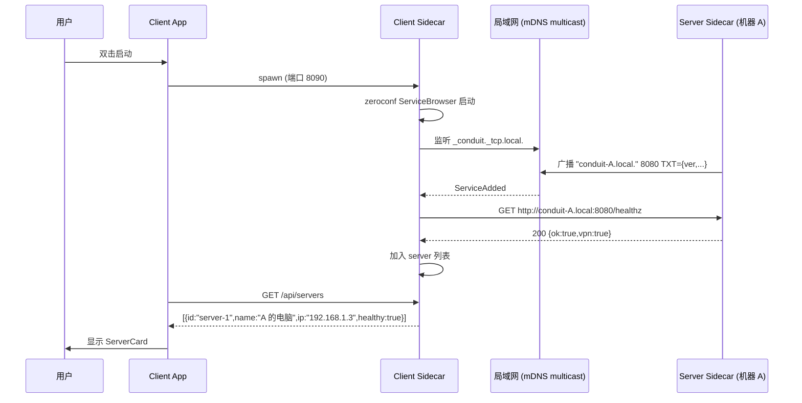
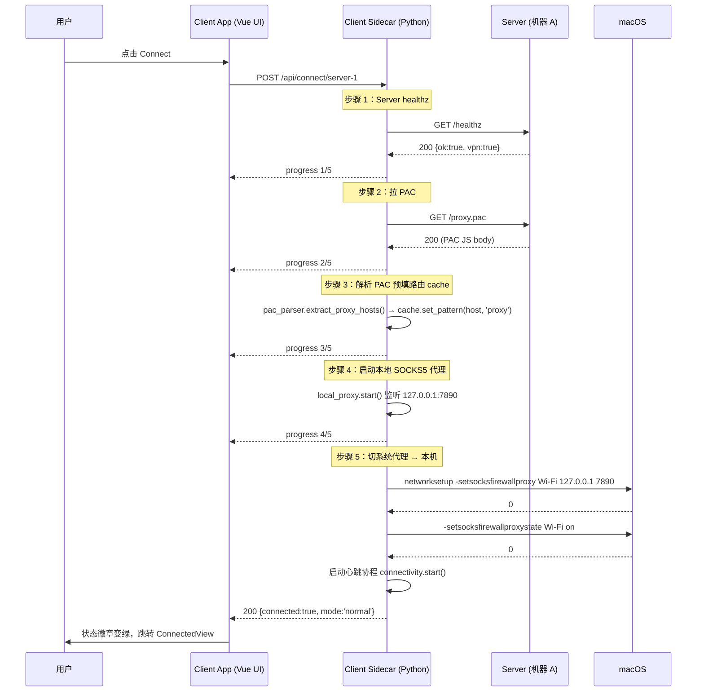
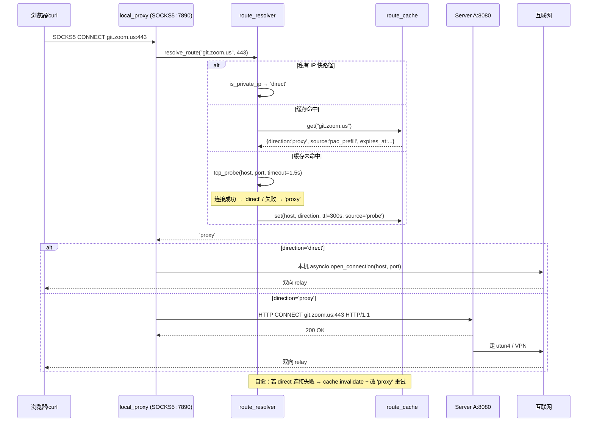
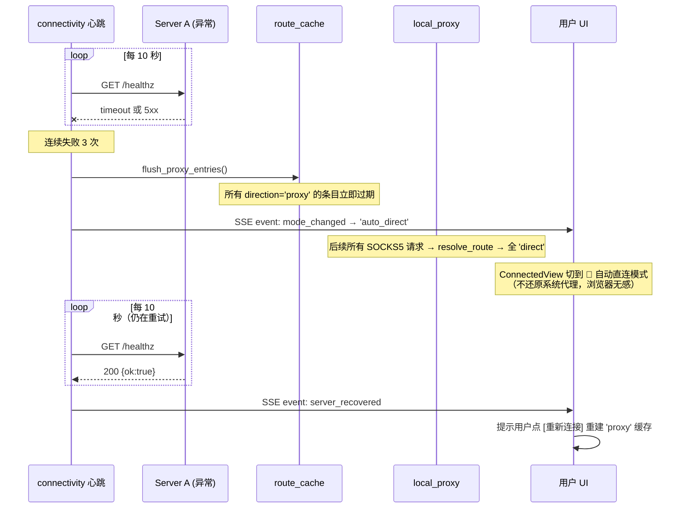

# Conduit Client — 客户端桌面应用可行性报告

> 项目代号：**Conduit Client**（机器 B 的桌面应用）
> 日期：2026-04-30
> 范围：把 `2026-04-29-2-机器B客户端配置手册.md` 里的"手动配 PAC URL"流程封装成"双击安装即用"的桌面 App
> 前置文档：
> - `2026-04-29-局域网共享VPN代理简明设计.md`（服务端协议）
> - `2026-04-29-2-机器B客户端配置手册.md`（手动配置流程，本 App 要替代它）
> - `2026-04-30-Conduit-桌面化可行性报告.md`（服务端 App 可行性）
> - `2026-04-30-2-Conduit-Tauri+Python方案详细设计.md`（服务端 App 详细设计）

---

## 0. 项目命名与定位

**Conduit Client**（与服务端 **Conduit Server** 配对）

| 维度 | 说明 |
|---|---|
| 角色 | 机器 B（消费者）上的桌面 App |
| 核心架构 | **B 端启动一个本地 SOCKS5 代理**（127.0.0.1:7890），对每个连接做"先 direct，不通才 proxy"的智能决策 + 缓存——见 §3 |
| 不做什么 | ❌ 不重新发明代理协议（仍兼容 server-app 的 HTTP/SOCKS5）；❌ 不做 VPN 客户端；❌ 不做应用级深度过滤（不需要） |
| 核心价值 | 把手册里 5 个 OS × 4 类工具 = **20+ 套手动配置**收敛成"装上、点一下、生效"；并提供 PAC 模式做不到的"动态自动 fallback" |

### v0.1 范围声明

| 维度 | v0.1（本设计） | v0.2+ |
|---|---|---|
| 平台 | **仅 macOS 13+** | Windows / Linux |
| 代理协议 | 仅 SOCKS5（127.0.0.1:7890） | 同时启 HTTP CONNECT（8080） |
| 路由策略 | 智能本地代理（probe + cache）| 加缓存导出/导入、规则手工编辑 |
| 与 PAC 的关系 | A 的 PAC 仅作为**路由提示**预填客户端缓存，不再被浏览器直接消费 | 不变 |

> **为什么 v0.1 只做 macOS？** 把跨平台的 60% 工作量挪到 v0.2，让 v0.1 专注把"智能路由 + macOS 体验"打磨到 production-ready。

### 包名预留

- 应用：`Conduit Client.app`
- macOS Bundle ID：`com.terrellshe.conduit.client`
- Python 包：`conduit_client`

---

## 1. 背景与目标

### 1.1 现状（来自 `2026-04-29-2-机器B客户端配置手册.md`）

**机器 B 的非工程师用户**目前要做的事：

1. 找同事 A 拿到"局域网 IP + 端口"
2. 根据自己的 OS（macOS / Windows / Linux / iOS / Android）找对应章节
3. 决定走"自动 PAC"还是"全局代理"
4. 在系统设置里手动填 URL `http://192.168.1.3:8080/proxy.pac`
5. 配命令行工具的 `http_proxy` 环境变量
6. 配 Java / Python / Node 各种语言运行时的代理参数
7. **PAC 不生效时**回到手册 §4 走 5 步故障排除
8. **不用了之后**还要手动改回去（否则 A 关机后 B 整个网络 broken）

**问题清单**：

| # | 痛点 | 用户感受 |
|---|---|---|
| P1 | 5 个 OS × 4 类工具配置项太多 | "光看手册就要 20 分钟" |
| P2 | A 的 IP 变了（家 → 公司 / WiFi 重连）要重新填 | "每次到公司都要改一次" |
| P3 | A 关机 / VPN 断 → B 网络全 broken | "为什么我打不开百度了？" |
| P4 | 改回 DIRECT 操作记不住 | "卸载流程不会做" |
| P5 | 故障排查 5 步流程跑不下来 | "出问题就找 A 哥" |
| P6 | macOS sudo 改 networksetup 让人害怕 | "我的电脑要被搞坏了" |

### 1.2 客户端 App 的定位

**Conduit Client** 是上述手册的 GUI 替身：

```
手册 §2.1 (macOS) ─┐
手册 §2.2 (Windows)│
手册 §2.3 (Linux)  ├─→ Conduit Client App  →  双击 → 自动发现 → 一键开关
手册 §2.5 (iOS)    │
手册 §4 故障排查   │
手册 §3 验证       ┘
```

**App 必须能做到的事**：

| # | 能力 | 替代手册哪一节 |
|---|---|---|
| C1 | **mDNS 自动发现** LAN 上的 Conduit Server，无需输入 IP | §1（找同事拿 IP） |
| C2 | **一键开/关** 系统级 PAC 代理 | §2 全部 5 节 |
| C3 | **健康监测** Server 可达性，不可达自动降级 DIRECT | §4.1（一直转圈） |
| C4 | **域名分流可视化**：内嵌 `/check` 调用，输入域名就显示决策 | §4.6（怎么知道走哪条） |
| C5 | **故障诊断 Wizard**：自动跑手册 §4 的检查项 | §4 全部 |
| C6 | **退出即还原**：App 关闭/卸载自动改回 DIRECT，不留 orphan 配置 | §4.3（取消配置） |
| C7 | **状态可视化**：显示当前连了哪台 Server、本机流量 | （手册没有，新增） |

### 1.3 用户故事

```
作为 机器 B 的非工程师（设计师 / PM / 测试 / 实习生）
我想要 在 LAN 里有人开了 Conduit Server 时，我打开 Conduit Client 就能用
以便于 不需要找同事 A、不输入 IP、不改系统设置
```

```
作为 同时使用 macOS（家） + Windows（公司）的开发者
我想要 在两台机器上装同一个 Conduit Client，配置自动同步
以便于 不需要在公司重新配一遍代理
```

```
作为 临时来访的客人
我想要 用完不留任何系统残留
以便于 离开后不影响主人电脑的网络
```

---

## 2. 核心需求与边界

### 2.1 必须有（MVP, P0）

| ID | 需求 | 验收标准 |
|---|---|---|
| F-1 | 双击启动 | 装上后 Dock/开始菜单点一下就启动，无需终端 |
| F-2 | mDNS 自动发现 Server | LAN 内有 Server 时，App 启动后 ≤3s 显示 server 卡片 |
| F-3 | 一键应用代理 | 点 Connect 后 ≤2s 系统代理切到 PAC URL |
| F-4 | 一键解除代理 | 点 Disconnect 后 ≤1s 系统代理回 DIRECT |
| F-5 | 退出即还原 | 关闭 App / 杀进程时自动 disconnect |
| F-6 | 跨 macOS / Windows / Linux | 三大 OS 都能装、能跑、能切代理 |

### 2.2 应该有（P1）

| ID | 需求 |
|---|---|
| F-7 | Server 可达性心跳（每 10s `/healthz`），不可达红色警告 |
| F-8 | 不可达 ≥30s 自动 disconnect 改 DIRECT（避免 P3 痛点） |
| F-9 | Server 流量统计（订阅 `/api/events`） |
| F-10 | Host check：输入域名查 `/check?host=` |

### 2.3 可以有（P2）

| ID | 需求 |
|---|---|
| F-11 | 系统托盘 + 最小化到托盘 |
| F-12 | 开机自启（用户可关） |
| F-13 | 故障诊断 Wizard（手册 §4 自动化） |
| F-14 | 多 Server 切换（家 / 公司 / 同事 X） |

### 2.4 明确不做

- ❌ **应用级流量分流**：仍走系统级 PAC（避免变成 mihomo/Clash）
- ❌ **修改 hosts 文件**：风险大，没必要
- ❌ **VPN 客户端**：B 不直接连 VPN，是借 A 的 VPN
- ❌ **iOS / Android App**：手机端按手册手动配（OS 限制，第三方 App 改不了系统代理）

---

## 3. 客户端架构：智能本地代理（v0.1 主方案）

> Conduit Client v0.1 与"传统 PAC 直接配置浏览器"做法**完全不同**：客户端在本机启动一个轻量 SOCKS5 代理，对每个连接做"先 direct，不通才 proxy"的智能决策，并把结果缓存。本章描述这个架构的全貌。
>
> **v0.1 仅 macOS**。Windows / Linux 推到 v0.2，目的是把 macOS 这条路打磨到位。

### 3.1 决策概览

#### 为什么不沿用 PAC 直接配置？

PAC 文件由 A 提供给浏览器/OS，浏览器按 PAC 规则做决策。这个机制的根本局限：

| 问题 | 原因 |
|---|---|
| 决策是**静态**的 | PAC 只能基于 host/IP/port 判断，不能感知"某条线路实际通不通" |
| 浏览器**会把 PAC 缓存** | 服务端 PAC 改了，浏览器要等几小时甚至重启才感知 |
| 多浏览器**配置分散** | Chrome / Firefox / Safari / 系统级各不一致，配错一个就漏 |
| **无法"先 direct，不通才 proxy"** | 这正是 Conduit 现在最想要的行为 |

#### v0.1 主方案：B 端启动本地代理（Local Smart Proxy）

```
B 浏览器 / curl / git
    │
    │ 配置: socks5://127.0.0.1:7890
    ▼
┌────────────────────────────────────────────┐
│  B 上的 Conduit Client（本地代理引擎）     │
│                                            │
│  收到 CONNECT host:port                    │
│         │                                  │
│         ▼                                  │
│  ┌─ 路由缓存（TTL 5 min）─┐                │
│  │  命中 'direct' ─→ 走本机 DIRECT         │
│  │  命中 'proxy'  ─→ 转发 A:8080           │
│  │  未命中 ──→ probe                      │
│  └────────────────────────┘                │
│         │ 未命中                           │
│         ▼                                  │
│  TCP probe direct 1.5s                     │
│         │                                  │
│         ├─ 1.5s 内握手成功 ─→ DIRECT + 缓存 │
│         └─ 失败/超时         ─→ A:8080 + 缓存│
└────────────────────────────────────────────┘
```

#### 核心收益

| 收益 | 旧 PAC 方案 | 新本地代理方案 |
|---|---|---|
| **真正的动态 fallback** | ❌ | ✅（实测连通性） |
| **结果缓存** | 浏览器自管理（不可控） | ✅（client 自管理 TTL） |
| **跨浏览器统一** | ❌（各自配） | ✅（系统代理一处配） |
| **失效自愈** | ❌ | ✅（缓存命中失败 → 即时学习） |
| **B 端额外开销** | 0 | 一个本地进程（~15MB RAM） |

### 3.2 整体决策时序

#### 缓存命中 'direct'（最快路径）

```
B 浏览器              B 本地代理 :7890           目标 host
    │                       │                       │
    │── CONNECT host:443 ──▶│                       │
    │                       │ cache.lookup → direct │
    │                       │── TCP connect ───────▶│
    │                       │◀── SYN-ACK ───────────│
    │◀── proxy connected ───│                       │
                            (整体 < 50ms)
```

#### 缓存命中 'proxy'

```
B 浏览器              B 本地代理 :7890        A:8080            目标 host
    │                       │                  │                   │
    │── CONNECT host:443 ──▶│                  │                   │
    │                       │ cache.lookup → proxy                 │
    │                       │── CONNECT host:443 ──▶│              │
    │                       │                  │── via VPN ───────▶│
    │◀── proxy connected ───│                                      │
                            (整体 < 200ms，受 LAN + VPN 影响)
```

#### 缓存未命中 → probe → 'direct'

```
B 浏览器              B 本地代理 :7890           目标 host
    │                       │                       │
    │── CONNECT host:443 ──▶│                       │
    │                       │ cache.lookup → MISS   │
    │                       │── TCP SYN ───────────▶│
    │                       │◀── SYN-ACK 800ms ─────│
    │                       │ cache.set('direct')   │
    │                       │── TCP connect ───────▶│
    │                       │◀── SYN-ACK ───────────│
    │◀── proxy connected ───│                       │
                            (整体 < 1.5s)
```

#### 缓存未命中 → probe 失败 → 'proxy'

```
B 浏览器              B 本地代理 :7890           目标 host          A:8080
    │                       │                       │                 │
    │── CONNECT host:443 ──▶│                       │                 │
    │                       │ cache.lookup → MISS   │                 │
    │                       │── TCP SYN ───────────▶│                 │
    │                       │   (1.5s timeout)     │                 │
    │                       │ cache.set('proxy')    │                 │
    │                       │── CONNECT host:443 ────────────────────▶│
    │                       │                                         │── VPN ─▶│
    │◀── proxy connected ───│                                                  │
                            (整体 1.5s + LAN+VPN)
```

### 3.3 本地代理服务（SOCKS5）

#### 协议选择

| 协议 | 优势 | 取舍 |
|---|---|---|
| **SOCKS5** ✅ | 标准（RFC 1928）；浏览器 / curl / git / SSH / Docker 全支持；TCP/UDP 协议无关 | 部分老应用不支持 SOCKS5（这类应用通常也支持 HTTP 代理，可作为 v0.2 增强） |
| HTTP CONNECT | 浏览器和大部分应用支持 | 协议偏 HTTP-centric；UDP 不支持 |
| 透明代理（pf / iptables） | 完全无感 | macOS 下需要内核扩展，**不考虑** |

**v0.1 仅实现 SOCKS5**。HTTP CONNECT 可以作为 v0.2 增强（同一进程多监听一个 8080 端口）。

#### SOCKS5 实现细节

仅实现协议子集（够用即可）：

| 阶段 | 实现 | 不实现 |
|---|---|---|
| 协商 | `NO AUTHENTICATION REQUIRED` | 用户名/密码、GSSAPI |
| 命令 | `CONNECT` | `BIND`、`UDP ASSOCIATE` |
| 地址类型 | IPv4、Domain | IPv6（v0.2 加） |

监听地址：`127.0.0.1:7890`（用户可在 Settings 改端口）

#### 实现选型

| 方案 | 评估 |
|---|---|
| 自己写 SOCKS5（用 asyncio 拼） | ~150 行代码即可，**采用**；与现有 server-app 的 socks5_proxy.py 风格一致 |
| 引入 `python-socks` 等库 | 多一个依赖，对该子集需求过度 |
| 引入 mitmproxy / Shadowsocks 等大型工具 | 杀鸡用牛刀，包体积爆炸 |

### 3.4 路由解析与 Probe 算法

#### 决策入口

```python
# client-app/core/route_resolver.py

async def resolve_route(host: str, port: int) -> Direction:
    """对 host:port 做出 direct / proxy 决策。"""

    # 1) 快路径：私有 IP 段直连（10.x / 172.16.x / 192.168.x）
    if _is_private_ip(host):
        return 'direct'

    # 2) 查路由缓存
    entry = cache.get(host)
    if entry and not entry.expired():
        entry.touch()  # 更新 hit_count + last_used
        return entry.direction

    # 3) 缓存未命中 → probe
    direct_ok = await tcp_probe(host, port, timeout=1.5)
    direction: Direction = 'direct' if direct_ok else 'proxy'

    # 4) 写缓存
    cache.set(host, RouteEntry(
        host=host,
        direction=direction,
        expires_at=now() + timedelta(minutes=5),
        source='probe',
    ))
    return direction
```

#### Probe 实现

```python
async def tcp_probe(host: str, port: int, *, timeout: float = 1.5) -> bool:
    """单纯 TCP connect probe，不发任何应用层数据。"""
    try:
        try:
            ipaddress.ip_address(host)
            ip = host
        except ValueError:
            infos = await asyncio.wait_for(
                asyncio.get_running_loop().getaddrinfo(
                    host, port, family=socket.AF_INET
                ),
                timeout=0.5,
            )
            ip = infos[0][4][0]

        reader, writer = await asyncio.wait_for(
            asyncio.open_connection(ip, port),
            timeout=timeout,
        )
        writer.close()
        await writer.wait_closed()
        return True
    except (asyncio.TimeoutError, OSError):
        return False
```

#### 为什么用 TCP connect probe？

| Probe 方式 | 优势 | 缺陷 | 决策 |
|---|---|---|---|
| **TCP connect**（采用） | 协议无关、最快、最简 | "握手成功 ≠ 应用层可用"（中间网络可能丢包但 SYN-ACK 通） | ✅ 配合失效自愈足够好 |
| HTTP GET / 200 | 精确 | 慢（300-800ms）、需要 HTTP 服务存在 | ❌ |
| DNS 解析 | 极快 | "DNS 通 ≠ TCP 通" | ❌ |
| ICMP ping | 简单 | 大量网络封禁 ICMP；root 权限 | ❌ |

#### 私有 IP 快路径

LAN 内目标（如 `192.168.1.5`、`10.0.0.5`）不需要 probe：

```python
def _is_private_ip(host: str) -> bool:
    try:
        ip = ipaddress.ip_address(host)
        return ip.is_private or ip.is_loopback
    except ValueError:
        return False  # 是域名，按正常流程处理
```

### 3.5 路由缓存

#### 数据结构

```python
# client-app/core/route_cache.py

from dataclasses import dataclass, field
from datetime import datetime, timedelta
from typing import Dict, Literal

Direction = Literal['direct', 'proxy']
Source    = Literal['pac', 'probe', 'manual']

@dataclass
class RouteEntry:
    host: str
    direction: Direction
    expires_at: datetime
    source: Source              # 来源：pac=A 的 PAC 预填；probe=实测；manual=用户手工
    hit_count: int = 0
    last_used: datetime = field(default_factory=datetime.utcnow)

    def expired(self) -> bool:
        return datetime.utcnow() >= self.expires_at

    def touch(self) -> None:
        self.hit_count += 1
        self.last_used = datetime.utcnow()


class RouteCache:
    DEFAULT_TTL = timedelta(minutes=5)
    MAX_ENTRIES = 5000  # LRU 上限

    def get(self, host: str) -> RouteEntry | None: ...
    def set(self, host: str, entry: RouteEntry) -> None: ...
    def invalidate(self, host: str) -> None: ...
    def stats(self) -> CacheStats: ...
```

#### 失效自愈（关键）

如果缓存命中 `direct`，但实际尝试连接失败（TCP refused / timeout），客户端会**即时把缓存改为 `proxy`** 并重试，确保用户感知不到错误：

```python
# 在 SOCKS5 主流程里
direction = await resolver.resolve_route(host, port)
try:
    await _connect_with_direction(direction, host, port)
except OSError:
    if direction == 'direct':
        # 即时降级：缓存改 proxy，重试
        cache.set(host, RouteEntry(
            host=host,
            direction='proxy',
            expires_at=now() + timedelta(minutes=5),
            source='probe',
        ))
        await _connect_with_direction('proxy', host, port)
    else:
        raise  # proxy 也失败：A 不可达
```

#### 缓存预填（启动时）

启动时调 A 的 `GET /proxy.pac`，解析其中的 host 段，预填 `proxy` direction，避免对已知 VPN 域名做无意义 probe：

```python
# 提取 PAC 里 isInNet / shExpMatch 规则的 host 段
pac_proxy_hosts = pac_parser.extract_proxy_hosts(pac_content)
# 例：['*.zoom.us', '*.zoomdev.us', 'git.zoom.us', ...]

for host_pattern in pac_proxy_hosts:
    cache.set_pattern(host_pattern, RouteEntry(
        host=host_pattern,
        direction='proxy',
        expires_at=now() + timedelta(minutes=5),
        source='pac',
    ))
```

### 3.6 与 Server 的协作

#### 启动时

```
client-app 启动
    │
    ├─ 1. mDNS 发现 server 列表
    ├─ 2. 用户选择 / 默认连最近一次
    │
    ├─ 3. 拉 server PAC 文件 → 预填路由缓存（仅 'proxy' 段）
    │     调 GET http://A:8080/proxy.pac?ts=<unix>
    │
    ├─ 4. 启动本地 SOCKS5 服务监听 127.0.0.1:7890
    │
    ├─ 5. 改 macOS 系统代理 → SOCKS5 → 127.0.0.1:7890
    │     调 networksetup -setsocksfirewallproxy
    │
    └─ 6. 进入 Connected view
```

#### 运行时

```
client-app 运行中
    │
    ├─ 心跳：每 10s GET http://A:8080/healthz
    │       │
    │       ├─ 200 OK → 状态保持 🟢
    │       ├─ 1 次失败 → 🟢（暂不动）
    │       ├─ 2 次失败 → 🟡 服务异常（仍尝试转发到 A）
    │       └─ 3 次失败 → 🔴 全局降级 'direct'
    │
    └─ 转发：把所有 cache='proxy' 的请求转给 A:8080
```

#### A 失败时的全局降级

```python
class GlobalRoutingMode:
    """全局路由模式（A 不可达时的降级开关）。"""
    state: Literal['normal', 'a_unreachable']

    def on_heartbeat_failure(self):
        # A 不可达：所有未来请求强制走 'direct'
        self.state = 'a_unreachable'
        self.cache.flush_proxy_entries()  # 清掉所有 'proxy' 缓存
        notify_ui("已自动切回直连模式")

    def on_heartbeat_recovery(self):
        # A 恢复了：清空缓存让 probe 重新决策
        self.state = 'normal'
        self.cache.flush_all()
        notify_ui("Server 已恢复，可点击重连")
```

### 3.7 macOS 系统代理设置（v0.1 单平台）

> v0.1 仅 macOS。Windows / Linux 留待 v0.2。理由：缩小 MVP 范围、专注一条体验线打磨到位。

#### 代理切换

```python
# client-app/core/system_proxy.py（极简版，单平台）

class MacSystemProxy:
    """macOS 系统代理切换：仅设置/还原 SOCKS5 指向本机。"""

    def enable(self, *, host: str = "127.0.0.1", port: int = 7890) -> None:
        service = self._active_network_service()  # 'Wi-Fi' / 'Ethernet'
        subprocess.run(
            ["networksetup", "-setsocksfirewallproxy", service, host, str(port)],
            check=True,
        )
        subprocess.run(
            ["networksetup", "-setsocksfirewallproxystate", service, "on"],
            check=True,
        )

    def disable(self) -> None:
        service = self._active_network_service()
        subprocess.run(
            ["networksetup", "-setsocksfirewallproxystate", service, "off"],
            check=True,
        )

    def _active_network_service(self) -> str:
        # 找当前活跃的网络服务，优先 Wi-Fi
        services = subprocess.check_output(
            ["networksetup", "-listallnetworkservices"], text=True
        ).splitlines()[1:]
        for s in services:
            if s.startswith("*"):  # 已禁用
                continue
            if s in ("Wi-Fi", "Ethernet"):
                return s
        return services[0]
```

#### 是否需要 sudo？

实测：

| macOS 版本 | `networksetup -setsocksfirewallproxy` |
|---|---|
| 11 / 12 | 可能弹密码（取决于系统配置） |
| 13 / 14 / 15 | **免密**（普通用户可执行） |

**v0.1 假设 macOS 13+，不再做 elevation 处理**。如果 macOS 11/12 用户报告需要密码，再加 fallback（v0.2）。

#### 退出还原（三道保险）

App 退出时（包括崩溃后），必须保证系统代理被还原：

```python
# 1. Tauri main.rs 注册退出 hook
on_close_request -> kill_sidecar -> wait_for_cleanup

# 2. Python sidecar 用 atexit
atexit.register(system_proxy.disable)

# 3. 启动时清理上次崩溃残留
def cleanup_on_startup():
    if system_proxy.is_set_to_us():  # 检查代理是否仍指向本机
        system_proxy.disable()
```

### 3.8 macOS Local Network Privacy（保留）

**问题**：macOS 14+ 对 LAN 内访问会弹"允许 Conduit Client 访问本地网络？"，用户拒绝就发现不到 Server。

**对策**：
- Tauri 启动时立即触发一次 mDNS 广播，让系统弹原生对话框
- App 内首屏放醒目说明
- 提供"重置权限"按钮：`tccutil reset NSLocalNetworkUsageDescription com.terrellshe.conduit.client`
- `Info.plist` 内带 `NSLocalNetworkUsageDescription` 中英文说明

### 3.9 mDNS 跨子网失效（保留）

**问题**：mDNS 默认仅在同一 broadcast domain（同一子网/同一 VLAN）工作。企业 WiFi 经常配 VLAN 隔离 → 客户端发现不了 Server。

**对策**：3 层兜底策略

```
1. mDNS 发现（同子网） → 找到立即用
   ↓ 5s timeout
2. 历史记录回放：用 ~/Library/Application Support/Conduit/last-server.json 中的 IP 直接尝试
   ↓ healthz 失败
3. 手动输入 IP（兜底）→ Settings 页面
```

UI 上：DiscoveryView 显示 **"已发现"** + **"最近用过"** + **"手动添加"** 三个区块，永远给用户出路。

### 3.10 Server 失败的体验设计（智能代理框架重述）

**问题**：A 关机/VPN 断 → B 网络是否会"看起来坏了"？

**新对策**（智能代理下的自愈）：

| 场景 | 行为 |
|---|---|
| A 健康，缓存命中 'proxy'，但 A 上 VPN 断了 | A 转发会失败 → B 收到错误 → 把缓存改 'direct' 重试 → 直连 |
| A 健康，缓存命中 'direct'，目标实际不通 | B 收到 TCP refused → 缓存改 'proxy' 重试 → 走 A |
| A 心跳连续 2 次失败 | UI 标 🟡，但仍尝试转发（也许只是网络抖动） |
| A 心跳连续 3 次失败 | 全局降级 'direct'，UI 标 🔴 + Toast，所有请求走本地直连 |
| A 恢复 | UI 提示，用户点"重新连接" → 缓存清空，重新走 probe |

**关键**：v0.1 智能代理使得"A 突然挂了"对用户**几乎无感**——只是访问 VPN 内网域名会失败，外网照常。

### 3.11 PAC 在新架构中的角色

PAC 文件**不再被浏览器直接消费**，而是作为 **B 客户端的"路由提示"**：

| 旧用法（PAC 模式） | 新用法（智能代理） |
|---|---|
| 浏览器读 PAC，按规则做静态分流 | client 启动时拉 PAC，解析里面的"必走 proxy"段，预填到路由缓存 |
| PAC 改了，浏览器要等几小时才感知 | client 每次启动重拉，永远新鲜 |

A 的 server-app 仍然提供 `/proxy.pac` 端点（向后兼容没装 client-app 的用户，他们仍可走旧 PAC 模式，但会失去智能 fallback）。

### 3.12 Server 升级感知（保留）

服务端 mDNS TXT 记录带版本号 + 端点：

```
_conduit._tcp.local.:
  port=8080
  TXT:
    ver=0.1.0
    proto=http+socks5+pac
    pac_path=/proxy.pac
    healthz=/healthz
    api_base=/api
```

客户端发现时直接读 TXT 知道完整端点信息，server 改路径不需要客户端跟着升级。

---

## 4. 技术栈选型

### 4.1 已锁定：Tauri 2 + Vue 3 + Python sidecar

> 与服务端 App 完全一致的栈，复用 90% UI 组件库（`@conduit/shared-ui`）。

| 层 | 选型 | 与 server-app 的关系 |
|---|---|---|
| 桌面壳 | Tauri 2 | 同栈 |
| 前端框架 | Vue 3 + shadcn-vue + Tailwind v4 | **复用 `shared-ui`** |
| 折线图 | uPlot | 同栈 |
| 后端语言 | Python 3.10+ | 同栈，但**职责完全不同** |
| 后端打包 | PyInstaller / Nuitka | 同栈 |
| 进程通信 | localhost HTTP（127.0.0.1:8090） | 同模式，端口换成 8090 避开 server 的 8080 |

### 4.2 为什么客户端也要 Python sidecar？

| 候选 | 分析 | 结论 |
|---|---|---|
| 纯 Rust 实现 | mDNS 库 `mdns-sd` 可用、`reqwest` 可用、注册表 / `networksetup` 也能调 | 包小（~10MB），但开发工作量高 |
| **Tauri + Python sidecar** | `zeroconf` 库跨平台最稳；与 server-app 工程结构对齐；shared-ui 完全复用 | ✅ **选这个** |
| Tauri + Node sidecar | Node 的 mDNS 库（`bonjour-service`）在 Linux 上有 bug | ❌ |

**Python sidecar 在 client-app 里负责**：
- mDNS 发现（zeroconf）
- 跨平台修改系统代理（subprocess + winreg）
- Server 心跳监测
- PAC 决策查询（调 `/check`）
- 暴露 `127.0.0.1:8090/api/*` 给本机 client UI

**Python sidecar 不负责**（与 server-app sidecar 的根本区别）：
- ❌ 不监听 0.0.0.0
- ❌ 不做 HTTP/SOCKS5 代理
- ❌ 不写 PAC 文件
- ❌ 不做 LAN 接入

### 4.3 包体积估算

| 组件 | 体积 |
|---|---|
| Tauri Rust shell | ~5MB |
| Python sidecar（Nuitka） | ~25MB |
| shared-ui + Vue 应用代码 | ~3MB |
| 资源（图标、字体） | ~2MB |
| **合计 .dmg / .msi** | **~35MB** |

> 与 server-app 的 ~40MB 相当，对内部工具来说完全可接受。

---

## 5. 整体架构

### 5.1 进程结构

```
┌──────────────────────────────────────────────────────────────────────┐
│  Conduit Client.app  (机器 B 上，v0.1 仅 macOS 13+)                  │
│                                                                      │
│  ┌────────────────────────────────────────────────────────────────┐  │
│  │  Tauri 主进程 (Rust, ~5MB)                                      │  │
│  │  ├─ main.rs:       启动 spawn sidecar、关闭 kill sidecar        │  │
│  │  ├─ healthz.rs:    等 :8090/healthz 200 才显示窗口              │  │
│  │  ├─ tray.rs:       4 态托盘（已连接/自动直连/心跳异常/未连接）   │  │
│  │  └─ commands.rs:   IPC commands（open_external、quit_app）      │  │
│  └────────────────────────────────────────────────────────────────┘  │
│         │ spawn                                  │ webview           │
│         ▼                                        ▼                   │
│  ┌──────────────────────────────────┐  ┌──────────────────────────┐  │
│  │ Python Sidecar (~25MB)           │  │ WebView                  │  │
│  │                                  │  │  Vue 3 + shadcn-vue      │  │
│  │ 监听端口：                        │  │  + Tailwind v4 + uPlot   │  │
│  │  ├ 127.0.0.1:7890 (SOCKS5 代理)  │  │                          │  │
│  │  └ 127.0.0.1:8090 (控制 API)    │◄─┤ fetch(127.0.0.1:8090/    │  │
│  │                                  │  │  api/...)                │  │
│  │ 核心模块：                        │  │ EventSource(/api/events) │  │
│  │  ├─ local_proxy.py (SOCKS5)      │  │                          │  │
│  │  ├─ route_resolver.py (cache+probe)  │                          │  │
│  │  ├─ route_cache.py (TTL/LRU/自愈)│  │                          │  │
│  │  ├─ pac_parser.py (启动预填)     │  │                          │  │
│  │  ├─ discoverer.py (mDNS)         │  │                          │  │
│  │  ├─ connectivity.py (心跳)       │  │                          │  │
│  │  └─ system_proxy.py (macOS only) │  │                          │  │
│  │                                  │  │                          │  │
│  │ 控制 API：                        │  │                          │  │
│  │  ├─ /api/servers (发现列表)      │  │                          │  │
│  │  ├─ /api/connect、/api/disconnect│  │                          │  │
│  │  ├─ /api/route?host= (查询路由)  │  │                          │  │
│  │  ├─ /api/cache (缓存增删查)      │  │                          │  │
│  │  ├─ /api/diagnose (5 步自检)     │  │                          │  │
│  │  └─ /api/events (SSE)            │  │                          │  │
│  └──────────────────────────────────┘  └──────────────────────────┘  │
│         │ mDNS 监听                                                  │
│         │ networksetup -setsocksfirewallproxy <wifi> 127.0.0.1 7890  │
└──────────────────────────────────────────────────────────────────────┘
                                  ▲
              浏览器/curl 走 SOCKS5│7890
                                  │
       ┌──────────────── route_resolver 决策 ────────────────┐
       │                                                    │
       ▼ 'direct'                                  'proxy'  ▼
   本地直连互联网                            HTTP CONNECT 转发到 A:8080
                                                    │
                                                    ▼
                               LAN 上的 Conduit Server (机器 A，192.168.1.3:8080)
                                                    │
                                                    ▼ utun4 / GlobalProtect VPN
                                              公司内网 + 互联网

mDNS 广播：A → B  _conduit._tcp.local.
PAC 预填：A → B  http://A:8080/proxy.pac (启动时一次)
```

### 5.2 mDNS 发现链路



### 5.3 连接链路（5 步进度）



### 5.4 路由决策链路（运行时）



### 5.5 故障 fallback 链路（全局降级）



---

## 6. UI 设计草图

> 4 个 view，依据用户路径切换。无 vue-router，用 stores/useUiStore 管理当前 view。

### 6.1 DiscoveryView（首屏 / 未连接）

```
┌─ Conduit Client ─────────────────────────────────────────┐
│  [⚪ 未连接]                                              │
├──────────────────────────────────────────────────────────┤
│                                                          │
│  发现 LAN 上的 Conduit Server                            │
│                                                          │
│  ┌────────────────────────────────────────────────────┐  │
│  │ 🟢 A 的 MacBook Pro                                │  │
│  │    192.168.1.3 : 8080                              │  │
│  │    VPN: ✅ utun4    版本: 0.1.0                    │  │
│  │    [连接]                                          │  │
│  └────────────────────────────────────────────────────┘  │
│                                                          │
│  最近用过 (1)                                            │
│  ┌────────────────────────────────────────────────────┐  │
│  │ 同事 X 的电脑                                      │  │
│  │    192.168.1.10 : 8080  (3 天前用过)               │  │
│  │    [尝试连接]                                      │  │
│  └────────────────────────────────────────────────────┘  │
│                                                          │
│  [+ 手动添加 Server]   [🔄 重新搜索]                     │
└──────────────────────────────────────────────────────────┘
```

### 6.2 ConnectedView（已连接 / 主面板）

```
┌─ Conduit Client ─────────────────────────────────────────┐
│  [🟢 已连接]   A 的 MacBook Pro  192.168.1.3            │
│  上线: 12 分钟前      心跳: ✅ 正常                       │
├──────────────────────────────────────────────────────────┤
│  系统代理状态                                            │
│  ┌────────────────────────────────────────────────────┐  │
│  │ Wi-Fi  ✅ PAC 模式                                 │  │
│  │ URL: http://192.168.1.3:8080/proxy.pac?ts=...      │  │
│  └────────────────────────────────────────────────────┘  │
│                                                          │
│  实时流量                                                │
│  ┌────────────────────────────────────────────────────┐  │
│  │  KB/s ▲                                            │  │
│  │       │   /\___        ↓ 540 K/s                   │  │
│  │       │__/    \____    ↑ 12 K/s                    │  │
│  │       └──────────────► 时间                        │  │
│  └────────────────────────────────────────────────────┘  │
│                                                          │
│  Host Check                                              │
│  ┌────────────────────────────────────────────────────┐  │
│  │ 输入域名: [github.com_______]   [查询]             │  │
│  │ 结果: PROXY 192.168.1.3:8080; DIRECT               │  │
│  │       (优先走 A 的 VPN，失败回退本地直连)           │  │
│  └────────────────────────────────────────────────────┘  │
│                                                          │
│  [🛑 断开连接]   [🔧 故障诊断]                           │
└──────────────────────────────────────────────────────────┘
```

### 6.3 DiagnosticView（故障诊断 Wizard）

按手册 §4 自动化逐项检查：

```
┌─ 故障诊断 ───────────────────────────────────────────────┐
│  正在自检……                                              │
│                                                          │
│  [✅] Step 1: B 与 A 在同一 WiFi    (192.168.1.x)        │
│  [✅] Step 2: A 的 Server 在跑     (响应 /healthz)        │
│  [⚠️] Step 3: A 的 VPN 状态        ("vpn_ok": false)     │
│  [✅] Step 4: 端口开放              (8080 可达)           │
│  [✅] Step 5: PAC URL 配置正确      (system 已 set)       │
│                                                          │
│  ⚠️ 发现 1 项问题                                         │
│                                                          │
│  > A 的 GlobalProtect VPN 似乎已断开。                   │
│    你访问公司内网域名（如 git.zoom.us）会失败，           │
│    但访问外网（如 github.com）可能仍能通过 fallback 直连。│
│                                                          │
│    建议：联系 A 检查 VPN 状态，或临时改用 DIRECT 模式。   │
│                                                          │
│  [🔧 暂时改用 DIRECT]   [🔄 重新检测]   [📋 复制报告]    │
└──────────────────────────────────────────────────────────┘
```

### 6.4 SettingsView（设置）

```
┌─ 设置 ───────────────────────────────────────────────────┐
│  常规                                                    │
│    ☐ 开机自启                                            │
│    ☑ 关闭主窗口最小化到托盘                              │
│    ☑ Server 不可达时自动切回直连                         │
│                                                          │
│  发现                                                    │
│    ☑ 启用 mDNS 自动发现                                  │
│    超时:  [5  ] 秒                                        │
│                                                          │
│  手动添加 Server                                         │
│    名称:  [____________________]                          │
│    IP:    [____________________]   端口: [8080]           │
│    [+ 添加]                                              │
│                                                          │
│  已保存的 Server (3)                                     │
│    A 的电脑          192.168.1.3:8080    [删除]          │
│    同事 X            192.168.1.10:8080   [删除]          │
│    家里的服务器       10.0.0.5:8080      [删除]          │
└──────────────────────────────────────────────────────────┘
```

---

## 7. 与服务端的协议契约

### 7.1 mDNS service 定义

| 字段 | 值 |
|---|---|
| service type | `_conduit._tcp.local.` |
| port | 8080（代理端口，与 PAC 端口同） |
| TXT records | `ver=0.1.0` `proto=http+socks5+pac` `pac_path=/proxy.pac` `healthz=/healthz` `api_base=/api` |

**服务端实现**（`server-app/core/mdns_advertiser.py`）：

```python
from zeroconf import IPVersion, ServiceInfo, Zeroconf

class MdnsAdvertiser:
    SERVICE_TYPE = "_conduit._tcp.local."

    def __init__(self, name: str, lan_ip: str, port: int) -> None:
        self.zc = Zeroconf(ip_version=IPVersion.V4Only)
        self.info = ServiceInfo(
            self.SERVICE_TYPE,
            f"{name}.{self.SERVICE_TYPE}",
            addresses=[bytes(map(int, lan_ip.split(".")))],
            port=port,
            properties={
                "ver": "0.1.0",
                "proto": "http+socks5+pac",
                "pac_path": "/proxy.pac",
                "healthz": "/healthz",
                "api_base": "/api",
            },
        )

    def start(self) -> None:
        self.zc.register_service(self.info)

    def stop(self) -> None:
        self.zc.unregister_service(self.info)
        self.zc.close()
```

### 7.2 复用的 server endpoint

| Server endpoint | client-app 用法 |
|---|---|
| `GET /healthz` | 心跳监测（每 10s） |
| `GET /api/status` | ConnectedView 显示 server 状态 |
| `GET /api/events` (SSE) | 流量图实时推送 |
| `GET /check?host=` | HostCheckPanel 域名分流查询 |
| `GET /proxy.pac` | 不直接用，让 OS 拉 |

### 7.3 client-app 自有 API（仅 127.0.0.1:8090）

> 注意：本机除了 8090 这个**控制 API 端口**，还监听 7890 作为**SOCKS5 代理端口**（受 §3.3 约束）。

| Endpoint | 说明 |
|---|---|
| `GET /api/servers` | 已发现 + 历史 + 手动添加的 server 列表 |
| `POST /api/connect/{server_id}` | 拉 PAC 预填路由缓存 + 启动本地 SOCKS5 + 切系统代理为 socks5://127.0.0.1:7890 |
| `POST /api/disconnect` | 还原系统代理 + 停 SOCKS5 + 清空路由缓存 |
| `GET /api/connection` | 当前连接状态 |
| `GET /api/diagnose` | 触发完整诊断（5 项检查） |
| `GET /api/route?host=...` | 查询某 host 当前的路由决策（含来源：cache hit / probe / pac） |
| `GET /api/cache` | 列出当前路由缓存条目（host / direction / TTL / source / hit_count） |
| `DELETE /api/cache` | 清空路由缓存（让所有 host 重新 probe） |
| `DELETE /api/cache/{host}` | 清掉单个 host 的缓存 |
| `GET /api/events` (SSE) | 状态变化推送给 UI（连接/断开/心跳/缓存命中/probe 完成） |
| `GET /healthz` | sidecar 自身健康检查（Tauri 等它） |

---

## 8. MVP 路线图

> 详细任务清单见独立文档 `2026-04-30-5-Conduit-开发TODO清单-进度S0完成.md` §S5、§S6。本节只列 client-app 的总览节奏。

### Sprint 0：地基（0.5 天）

- [ ] **T0-1** 创建 `client-app/{core,src-tauri,ui}/` 目录骨架
- [ ] **T0-2** ui/ 接入 `@conduit/shared-ui` workspace 引用
- [ ] **T0-3** 跑通空壳：`cargo tauri dev` 显示 DiscoveryView 占位

### Sprint 1：mDNS 发现 + 智能本地代理核心（2 天）

- [ ] **T1-1** server-app 增加 `mdns_advertiser.py`，启动时广播
- [ ] **T1-2** client-app/core 实现 `discoverer.py`（zeroconf ServiceBrowser）
- [ ] **T1-3** client-app/core 实现 `route_cache.py`（数据结构 + TTL + LRU + 失效自愈）
- [ ] **T1-4** client-app/core 实现 `route_resolver.py`（probe + 私有 IP 快路径 + PAC 预填）
- [ ] **T1-5** client-app/core 实现 `local_proxy.py`（SOCKS5 协议子集 + 转发到 A）
- [ ] **T1-6** client-app/core 实现 `system_proxy.py`（macOS only：networksetup -setsocksfirewallproxy）
- [ ] **T1-7** client-app/core 实现 `/api/connect` `/api/disconnect` `/api/route` `/api/cache`
- [ ] **T1-8** client-app/ui 实现 DiscoveryView + ConnectedView 基础版
- [ ] **T1-9** 端到端跑通：A 启动 server → B 启动 client → 自动发现 → 一键 connect → 浏览器配 SOCKS5 → 实际验证 baidu.com 走 direct、git.zoom.us 走 proxy

### Sprint 2：心跳与故障自愈（1 天）

- [ ] **T2-1** client-app/core 实现 `connectivity.py`（心跳协程）
- [ ] **T2-2** 心跳 2 次失败 → UI 标 🟡；3 次失败 → 全局降级 + flush proxy 缓存
- [ ] **T2-3** 系统通知（Tauri Notification API）
- [ ] **T2-4** ConnectedView 状态徽章三态切换 + fallback 提示横幅

### Sprint 3：可视化与缓存洞察（1 天）

- [ ] **T3-1** client-app/ui 接 server `/api/events` SSE 拿流量
- [ ] **T3-2** 路由智能卡片：缓存命中率、当前缓存条目数、最近 probe 列表
- [ ] **T3-3** 路由查询面板（输入 host → 显示决策 + 来源 + 上次更新）

### Sprint 4：故障诊断 Wizard（1 天）

- [ ] **T4-1** client-app/core 实现 `/api/diagnose` 五步检查
- [ ] **T4-2** DiagnosticView UI + 报告复制按钮
- [ ] **T4-3** "暂时改 DIRECT"按钮（一键 disconnect 但 client 仍后台跑）

### Sprint 5：体验优化 + 设置（0.5 天）

- [ ] **T5-1** SettingsView：开机自启、最小化托盘、缓存 TTL 调节
- [ ] **T5-2** 手动添加 Server 表单
- [ ] **T5-3** 系统托盘菜单（连接/断开/诊断/退出）+ 4 态图标

### Sprint 6：发布（仅 macOS，1 天）

- [ ] **T6-1** 应用图标（与 server-app 同主题色，但不同 logo）
- [ ] **T6-2** macOS Info.plist 加 `NSLocalNetworkUsageDescription`
- [ ] **T6-3** macOS 公证（用与 server-app 相同的 Apple Developer 证书）
- [ ] **T6-4** `.dmg` 安装器；`.pkg` 安装器（带 preremove 脚本还原代理）
- [ ] **T6-5** 用户文档：`docs/INSTALL.md` 客户端章节

**合计 6 天（v0.1 仅 macOS）**。Windows / Linux 推到 v0.2。

---

## 9. 风险与对策

> v0.1 仅 macOS 13+，所以"跨平台代理切换风险"全部下沉到 v0.2 再讨论。本表只列 v0.1 实际会遇到的风险。

| 风险 | 影响 | 概率 | 对策 |
|---|---|---|---|
| **TCP probe 假阳性**：缓存了 'direct' 但实际应用层不通（比如 SYN-ACK 通了但 TLS 握手中间断） | 用户首次访问该 host 失败 | 中 | 失效自愈：缓存命中 'direct' 但连接失败 → 即时改 'proxy' 重试；缓存的 hit_count 多次失败时缩短 TTL |
| **TCP probe 假阴性**：probe 失败但实际能直连 | 走 A 浪费带宽 | 低 | TTL 5 min 后自动重 probe；用户可在 UI 手工"清除该 host 缓存" |
| **首次未命中的 1.5s 延迟**：每个新 host 第一次访问要等 probe | 用户感觉首次加载慢 | 中 | 启动时拉 PAC 预填 'proxy' 段；私有 IP 快路径；并行 probe 多端口 |
| **macOS 13+ networksetup 仍要 sudo（小概率）** | 用户体验差 | 低 | 首次失败时弹 keychain 提示；记录到 ~/Library/Logs/ConduitClient/ |
| **mDNS 在企业 VLAN 失效** | 发现不了 server | 高 | 3 层兜底：mDNS → 历史回放 → 手动输入（DiscoveryView 三区块） |
| **Server 不可达，缓存仍然命中 'proxy' 卡死** | 用户感觉网络坏了 | 低 | 心跳 3 次失败 → 全局降级：所有缓存 'proxy' 强制改 'direct'，即时通知 UI |
| **macOS Local Network Privacy 被拒** | 永远发现不到 server | 低 | 首屏说明 + Settings 给"重置权限"按钮 |
| **客户端崩溃但代理没还原** | 网络坏了找不到原因 | 低 | Rust 主进程在 panic / signal handler 里同步调 disconnect；启动时检测代理是否仍指向本机自动还原 |
| **客户端被卸载没还原代理** | 同上 | 低 | 用 `.pkg` 安装器的 preremove 脚本调 networksetup -setsocksfirewallproxystate off |
| **多 client 实例互相抢端口** | 启动失败 | 低 | 启动时检测 7890 / 8090 已占用 → 拒绝启动并 focus 到已有窗口 |
| **shared-ui 升级破坏 client UI** | UI 渲染异常 | 中 | shared-ui 用 SemVer，breaking change 必须 server-app 和 client-app 同时升级；CI 跑 vitest 双 app 都覆盖 |

---

## 10. 依赖锁定清单

### 10.1 Python `client-app/core/pyproject.toml`

```toml
[project]
name = "conduit-client"
version = "0.1.0"
requires-python = ">=3.10"
dependencies = [
    "aiohttp>=3.10.0",        # 本地 API server
    "zeroconf>=0.130.0",      # mDNS 发现
]

[project.optional-dependencies]
build-dev = ["pyinstaller>=6.10.0"]
build-release = ["nuitka>=4.0.5", "ordered-set>=4.1.0"]
test = ["pytest>=8.0", "pytest-asyncio>=0.23"]
```

### 10.2 Rust `client-app/src-tauri/Cargo.toml`

```toml
[dependencies]
tauri = { version = "2", features = [] }
tauri-plugin-shell = "2"
tauri-plugin-notification = "2"
tauri-plugin-positioner = "2"
serde = { version = "1", features = ["derive"] }
serde_json = "1"
tokio = { version = "1", features = ["full"] }
reqwest = { version = "0.12", default-features = false, features = ["rustls-tls"] }
anyhow = "1"
thiserror = "2"
```

### 10.3 Vue `client-app/ui/package.json`

```json
{
  "name": "@conduit/client-ui",
  "dependencies": {
    "@conduit/shared-ui": "workspace:*",
    "vue": "^3.5.0",
    "@tailwindcss/vite": "^4.0.0",
    "tailwindcss": "^4.0.0",
    "uplot": "^1.6.32",
    "qrcode": "^1.5.4"
  },
  "devDependencies": {
    "@vitejs/plugin-vue": "^5.2.0",
    "vite": "^6.0.0",
    "vue-tsc": "^2.1.0",
    "typescript": "^5.7.0"
  }
}
```

---

## 11. 与 server-app 的协同点（实施顺序）

> 客户端依赖 server-app 已有部分能力，需要按以下顺序推进。

| # | 任务 | 在哪个 app | 依赖 |
|---|---|---|---|
| 1 | server `/healthz` 已有 | server-app | 无 |
| 2 | server `mdns_advertiser.py` | server-app | 无 |
| 3 | server `/api/events` SSE | server-app | 无 |
| 4 | server `/check?host=` 已有 | server-app | 无 |
| 5 | client mDNS 发现 | client-app | 依赖 #2 |
| 6 | client 系统代理切换 | client-app | 无 |
| 7 | client 心跳 + 流量图 | client-app | 依赖 #1, #3 |
| 8 | client HostCheckPanel | client-app | 依赖 #4 |

> 推荐先做 server-app 的 #2（mDNS），client-app 才能进入 sprint 1。其余可以并行。

---

## 12. 命令速查（开发期）

```bash
# 开发
cd client-app/src-tauri && cargo tauri dev

# 单独跑客户端 sidecar
cd client-app/core && python3 client_main.py --debug

# 单独跑客户端 UI
cd client-app/ui && pnpm dev

# 跨工程 dev（server + client 同时）
bash scripts/dev-all.sh

# 打 client sidecar
BUILDER=pyinstaller bash scripts/build-client-sidecar.sh   # 开发期
BUILDER=nuitka bash scripts/build-client-sidecar.sh        # 发布期

# 打整包
cd client-app/src-tauri && cargo tauri build
```

---

## 13. 接下来的动作

1. ⏭️ 用户 review 本可行性报告，确认范围与优先级
2. ⏭️ 在 server-app 中先实现 `mdns_advertiser.py`（约半天）
3. ⏭️ 创建 `client-app/` 目录骨架（Sprint 0）
4. ⏭️ Sprint 1：mDNS 发现 + 基础连接 → 跑通端到端 demo
5. ⏭️ Sprint 2-4：心跳 / 可视化 / 诊断
6. ⏭️ 用户体验测试：找一个非工程师 friend 装上试用，记录痛点
7. ⏭️ Sprint 5-6：体验优化 + 发布

> 待用户确认后，可立即按 Sprint 0 → 1 顺序开始实施。
